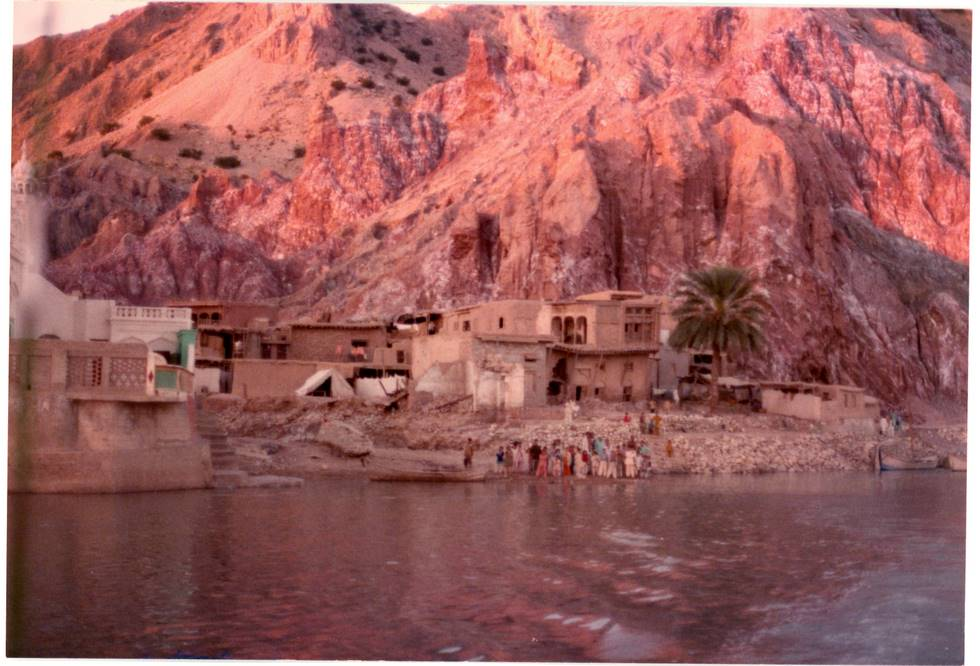

A village on the Indus river bank, upstream of Kalabagh:

## Comments (2)

**atiq butt** - February 25, 2010 11:41 PM

the mountain behind is made of salt.and the range so called SALT RANGE

**Noor ul huda** - May  7, 2010 11:47 AM

just a wonderful image from Pakistan

