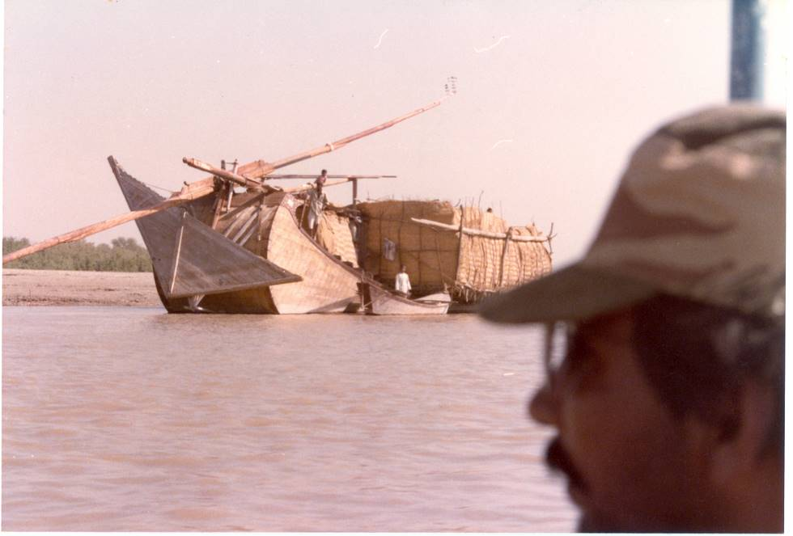

Dried fodder for cattle is being transported in a boat that the Egyptian Pharohs would have considered ancient.

## Comments (1)

**priscilla** - April 15, 2007  1:12 AM

That is a very impressive boat. I would like to sail on it.

---

