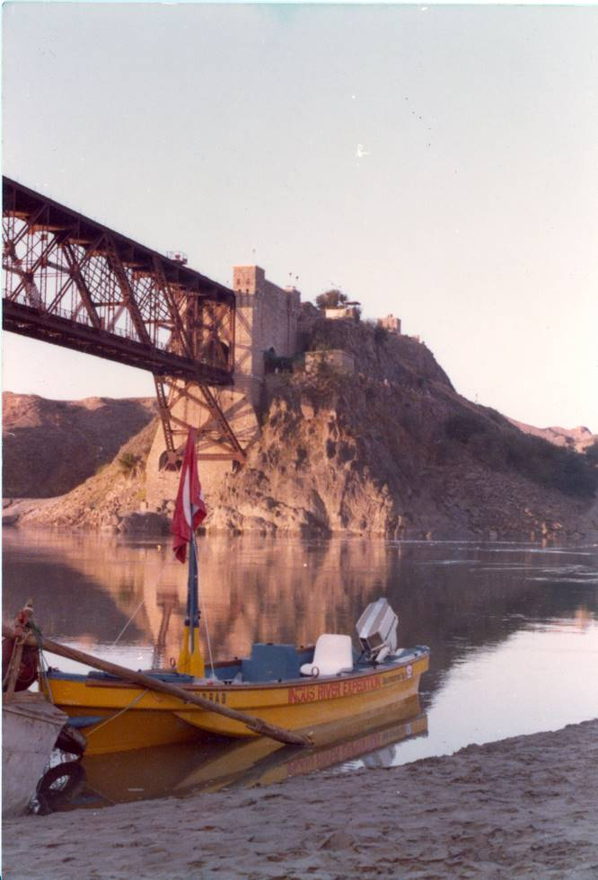

## Comments (2)

**atiq butt** - February 25, 2010 11:36 PM

the khushal garh bridge was constructed by british before independence.that was the 1st bridge for transporting both rail and vehicles at a time.upper portion for rail and lower there is road.but after its expiry it is only use as a road.it is in between Punjab and Pukhtoonkhwa province.Giving very beautiful view of Indus river.the road is called Pindi-Kohat road.
burjees@yahoo.com

---

**atiq butt** - February 25, 2010 11:39 PM

before 50 years we would see railways,vehicles and boats at a time from the point of capturing this snap.amazing.Pakistan zindabad

---

