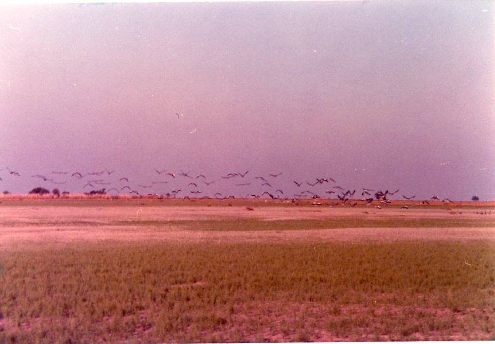

Cranes, also known as "koonj" in the vernacular, flying low over a field.

## Comments (1)

**Salman** - November  4, 2005  6:52 PM

Koonj or Kunj are not geese they are cranes -Demosielle cranes and common cranes.

