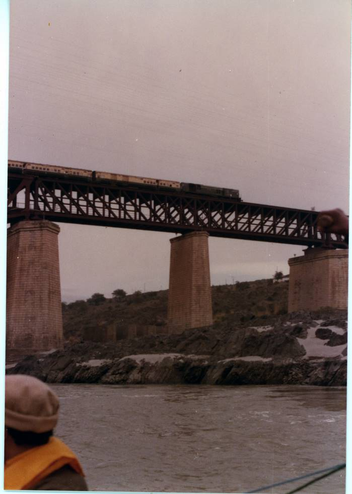

The train goes on top, and the cars go below. This bridge is now only used for bullock carts, as a new bridge has been made.

## Comments (3)

**Ali Jan** - September 28, 2006 12:28 AM

What a wonderfully memorable photo gallery of the 1978 Indus expedition. Thank you for putting up the photos here and sharing your great adventure story. What a remarkable feat! I really enjoyed going through this.

---

**priscilla** - April 15, 2007  1:22 AM

thank you for sharing those wonderful pictures of the expidition. I really enjoyed them. That was such an amazing thing to do.

---

**nojeed** - June 26, 2008  2:25 PM

I live near this (Attock) bridge. on each side of this bridge there is a sign board of a warning,"Taking photo of this bridge is strictly prohibited". So you have taken a picture of this and you have broken the law.

---

