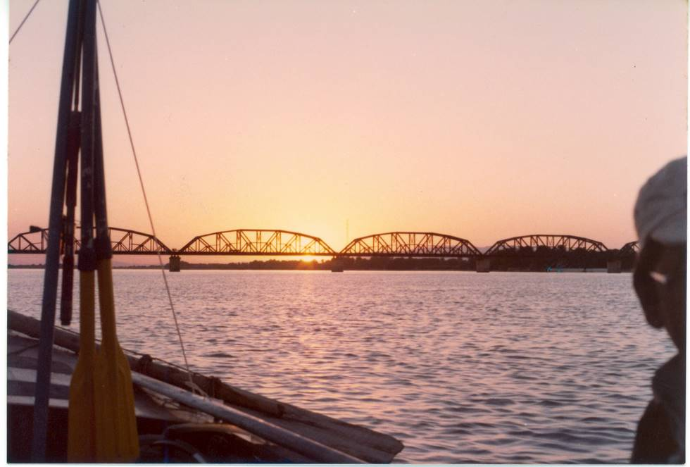

A view of Sukker road and railway bridge, dating back to the British Raj.

## Comments (6)

**Salman Ali** - November  4, 2005  6:57 PM

That looks like Landsdown Bridge, which is a few miles upstreamof Sukkur Barrage.

---

**Shelton Faria** - July 15, 2006  9:57 AM

I would like to see all the old bridges and barrages of sukkur and the city photographs of Sukkur and Rhodi, it is a nice city and it has allot of old images which still exist. Please show some nice and clear images of these sites.
Regards

Shelton

---

**priscilla** - April 15, 2007  1:07 AM

that looks like the snake river in washington state. usa. beautiful

---

**Shelton** - September 11, 2009  9:36 PM

Quetta has allot of British made bridges through Bolan Pass but no pictures are shown in this site, would like to see the pictures of these well built bridges.

---

**atiq butt** - February 25, 2010 11:48 PM

alas.
thats not sukker barrage.it is KALABAGH BRIDGE near Manwali district.British made.
and the snap is taken from the NAWAB OF KALA BAGH fort.i visited it and stayed for a whole week.if anyone need more pics i can provide.
thats one of the most amazing place i ever visited on earth.

---

**atiq butt** - February 25, 2010 11:51 PM

there are also 5000 old trees of pippul.any guideline required plz contact
burjees@yahoo.com

---

