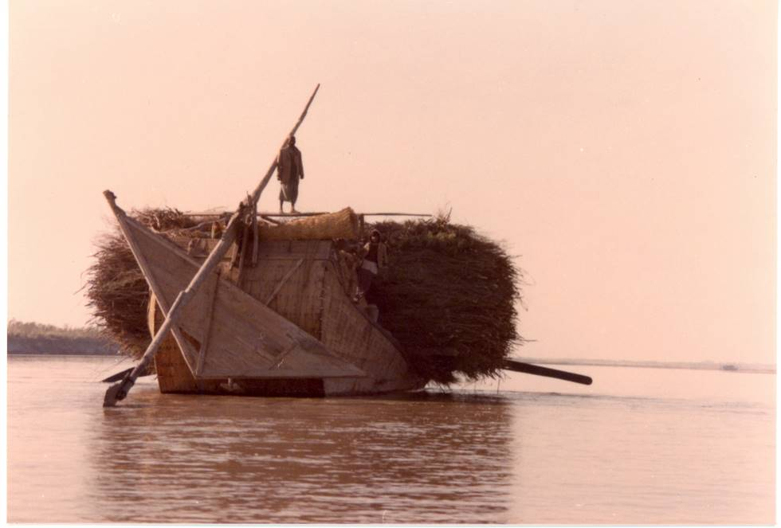

Traditional wooden boat carrying firewood down the Indus river. The design of the boat is similar to the model displayed in the Moenjodaro museum dating back to 3000 BC.

## Comments (1)

**Tarun Vijay** - July 29, 2006 12:24 AM

It was just a chance that I visited your fabulous site. In fact I too had led India's first indus expedition in Ladakh and visited this very year Hingol(Pakistan). You can imagine the joy I had seeing Indus and Hingol both on your site. I am also a trekker and love fourwheeling wherever and whenever it is possible. Two years before I had visited western Tibet and Indus source region too. Would love to be friends with your group and exchange info/photos.
Tarun Vijay
New Delhi ( India)

