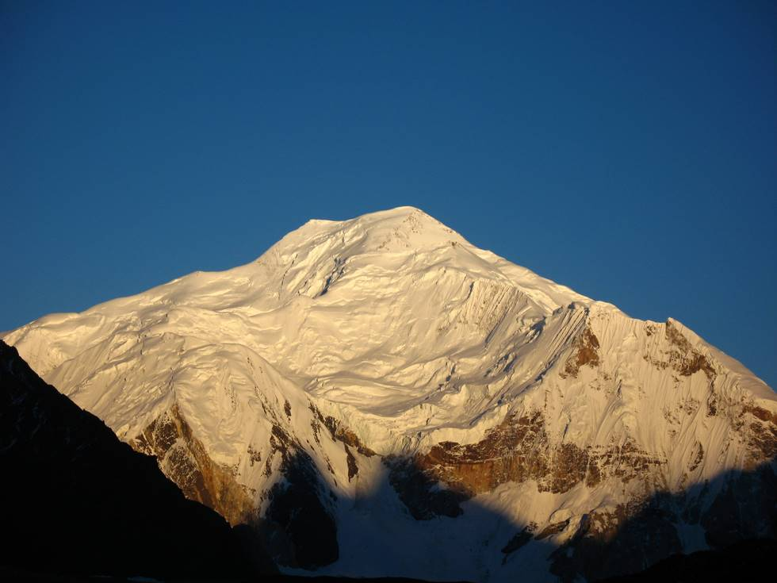

## Comments (4)

**Lars Mard** - August 10, 2007 10:10 PM

This whole set is fantastic, cheers to the photographer

**Hamid Omar** - August 11, 2007  5:01 AM

All the pictures of the treck to the K2 base camp were taken by Khalid Omar with a small Canon A640 Powershot camera. I have one too and its a very nice handy camera to use on off road and camping trips etc. Ho

**Yousuf** - February 21, 2011  3:18 AM

I must say Khalid Omar you have done a wonderful job of taking the pictures. We are planning on doing this trip in 2011. Any suggestions how to make the trip better than your experience?

**Irfan ul haq** - March 11, 2012 11:56 AM

it as baltoro kangri

