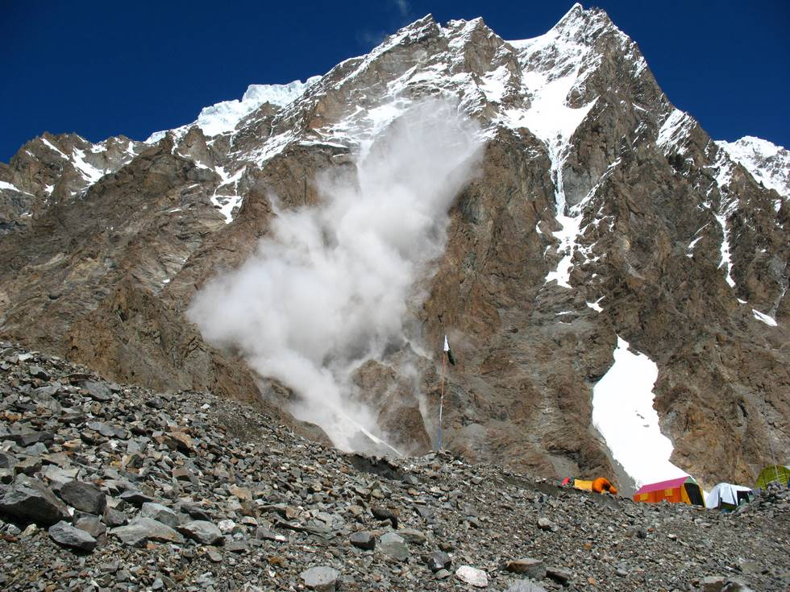

The K2 memorial is on K1, this avalanche just missed it, and hit the ground 50 metres from the Russian K2 base camp.

## Comments (2)

**Hamid Omar** - August 11, 2007  5:34 AM

Fanatstic photograph - thank God I was not standing at the base! Guess lucky me for I have never visited the area!

**aamir** - April  5, 2009 12:36 PM

right man at the right place at the right time.

