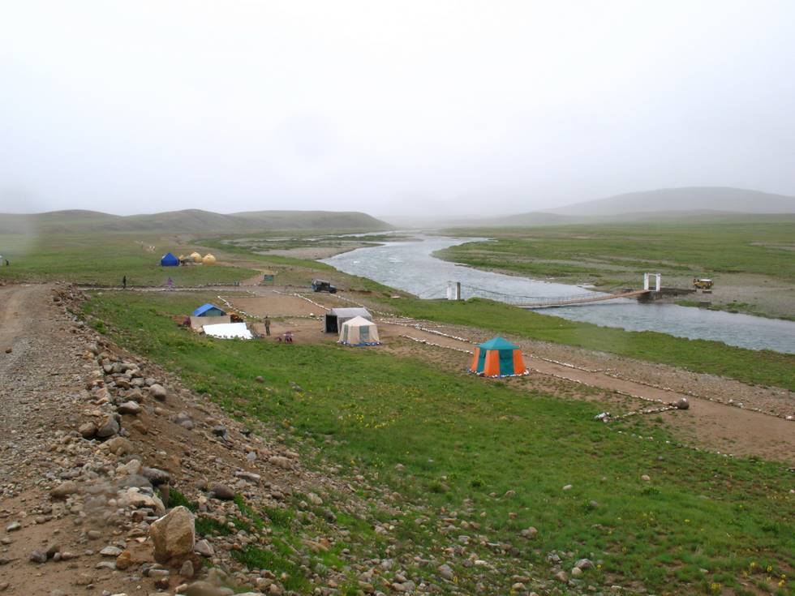

a suspension bridge made from wood and steel. some of the tents are living quarters for the park staff and others are restaurants (dhabas) where you can get chai loaded with sugar.. they also make parathas that remind you of your grandma's cooking..!