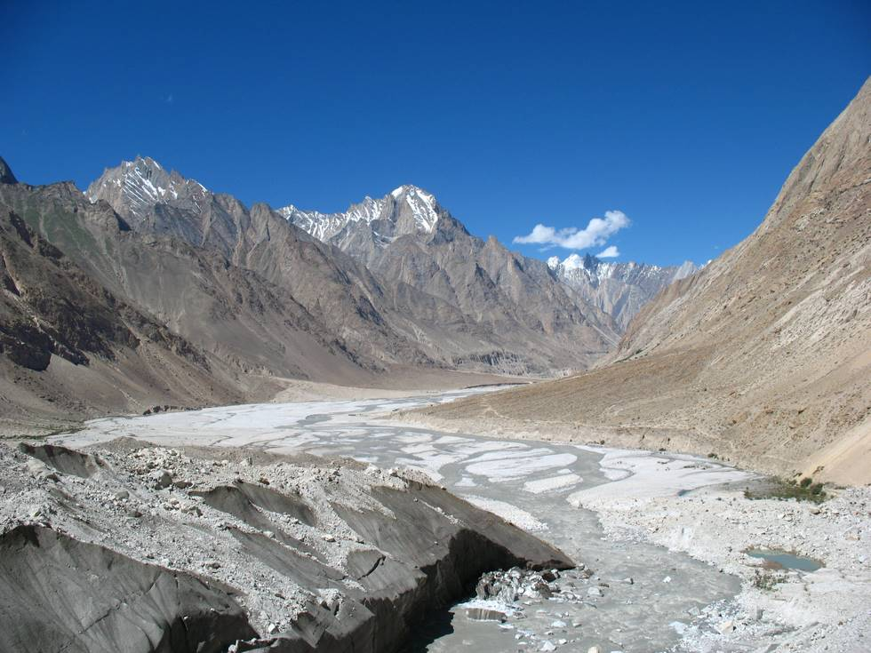

The start of the Braldu river, from the meltwater of the Baltoro glacier.

## Comments (1)

**koula bouloukos** - December  1, 2008 10:29 PM

We would like to permission to use this image in an educational video
on earth processes for the Royal Ontario Museum.

Please contact me at [removed].

Thank you,
Koula

---

