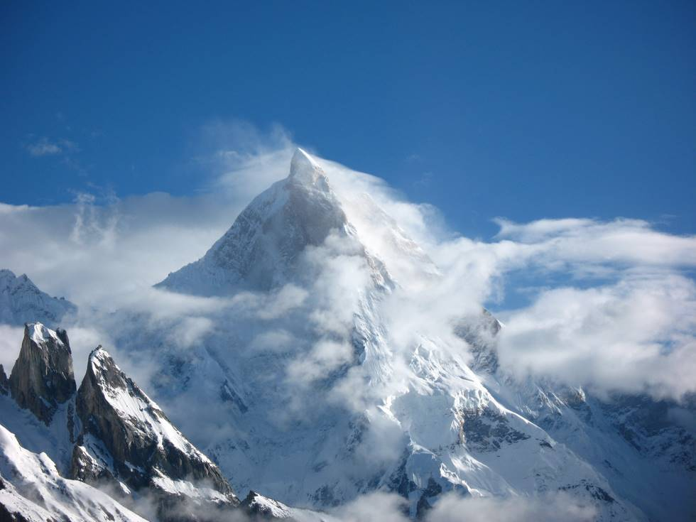

K2 is known as Chogori in the local language, which means Big Mountain. See the Wikipedia entry on K2 for more info.

## Comments (3)

**aamir** - April  5, 2009 10:54 AM

awesome.

**Mehwish** - May 19, 2009  4:14 PM

Is this K2 or Mashabrum?

**Yousuf** - February 27, 2011  6:36 AM

This is Mashabrum not K2.

