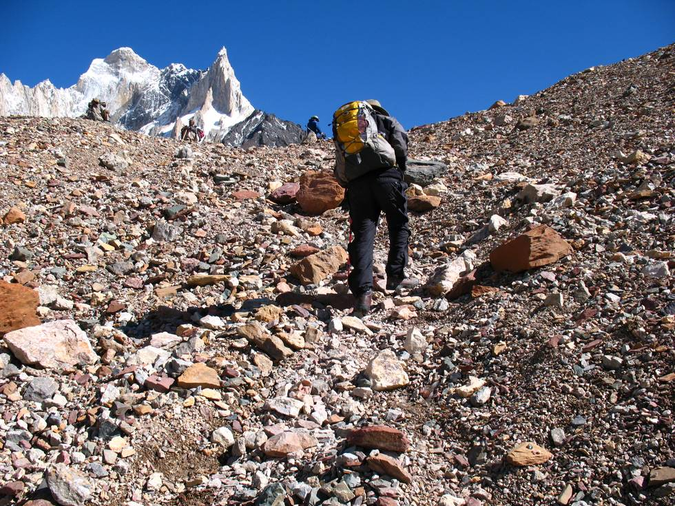

There are a lot of loose rocks, and the entire way goes up and down the glacier from Concordia.

## Comments (1)

**Hamid Omar** - August 11, 2007  5:22 AM

My advice to all - if you want to go to the K2 base camp - do it while you are still young! Also smoking is not advised as you walk up the trail - its only about 16,000ft or higher - you would be lucky if you can breath some air! Further advise - make the porters carry everthing! Even a bottle of water and a camera starts weighing a ton out there! You cannot ride on a mule there - so you can forget about that idea!

