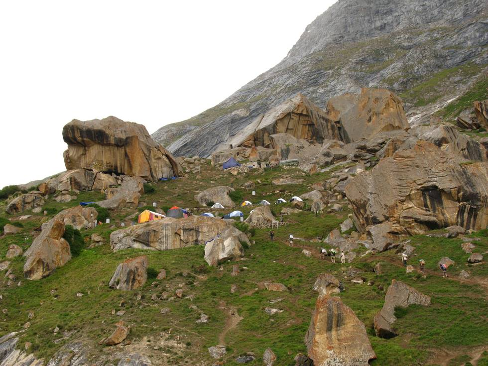

This campsite is great, with wonderful views of Cathedral peak and others across the glacier.

## Comments (1)

**Khizar** - August 16, 2007  5:07 PM

This was a beautiful campsite in terms of location. Its up the hill. We have to hike up almost 30 to 40 degrees to reach this campsite, from the baltoro glacier.

---

