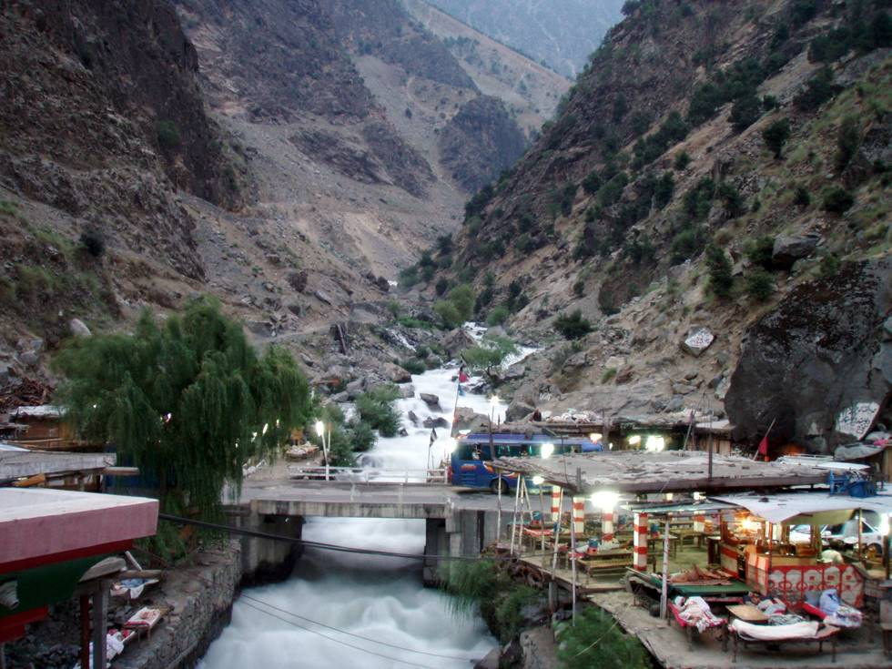

Restaurants clumped up alongside a river. All the truckers sleep on the roofs of these restaurants overnight. The chai is far too sweet, but the daal and sabzi is kickass!

## Comments (3)

**Imad** - August 12, 2007  9:38 AM

Nice pic. Slow shutter speed did the trick.

**khizar** - August 12, 2007  2:47 PM

Thank you.

**NARESH KUAMR** - October  9, 2007  4:52 PM

MY NAME IS NARESH KUMAR FROM SINDH OF PAKISTAN CITY RAHMOWALI PLEASE JHOD PUR PIC

