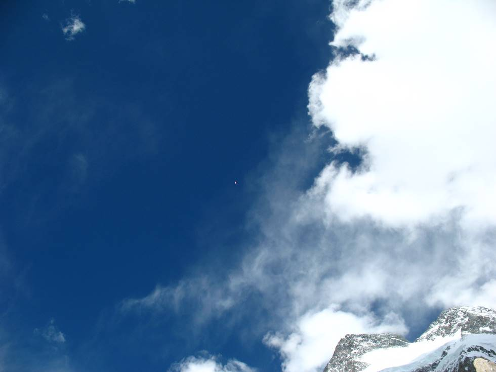

The small dot in the center of the picture is a paraglider who jumped from 7200 meters - Camp 3 of Broad Peak, and seemed to soar higher and higher.

## Comments (1)

**Khizar** - August 16, 2007  6:12 PM

Hmm.........

