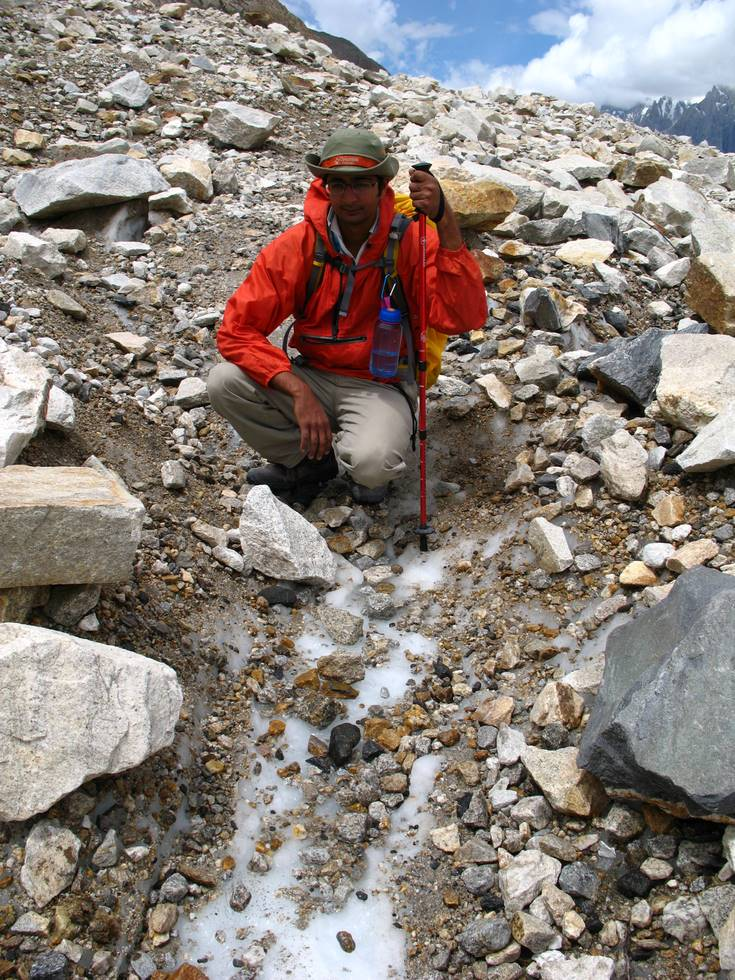

A view of the path. While the Baltoro is mostly covered with rocks and earth, at many places the ice is fully exposed - and very slippery! Also, closer to concordia, the people walking on the path clear up the dirt, exposing the ice and often times turning it into a channel of running water.