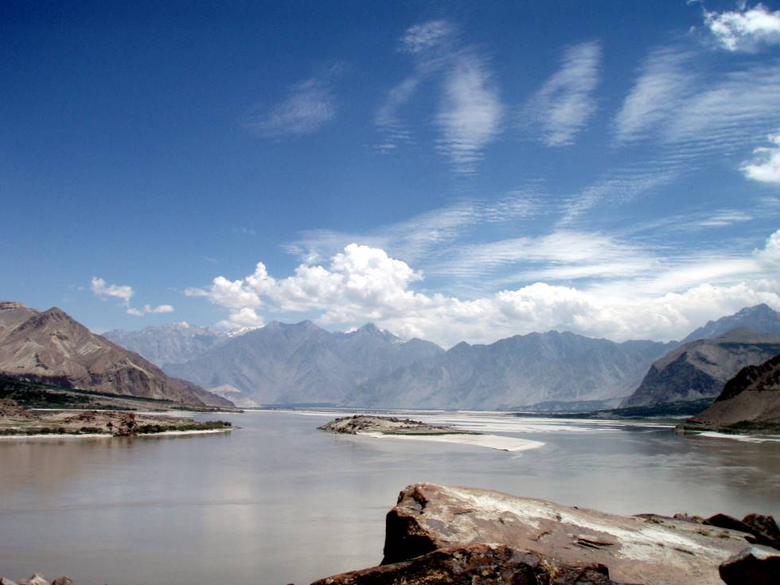

One of the advantages of going by road is that you can stop at the many scenic spots along the way.

## Comments (6)

**KARAM TALPUR** - December 18, 2008 12:11 PM

ITS REALLY VERY LOVELY SIGHT. I LOVE INDUS

---

**Irtaza** - April  5, 2009 11:05 AM

beautiful.

---

**George** - June  8, 2009  1:52 PM

it isn't very scenic it is just a river

---

**TARIQ** - September 15, 2009 11:58 AM

The pic shown its remind to every wise thats ALLAH is all mighty

---

**as** - February 13, 2010 10:37 AM

love u pakistan

---

**Kamile** - April 29, 2012  1:15 AM

RE: I was shopping at Harbor Freight last night for some items (you have to know which cheap Chinese items will work OK for you and which won't eg: their saeadppnr has a problem with the sand staying on the paper), and I got a big laugh out of one item in the automotive tools section: Emergency Impact Wrench it's a 12VDC impact wrench that you're supposed to keep in your trunk and use to change a flat tire. As soon as I saw that title, I translated it in my mind to: May work once, or If you're depending on this to actually work, it will be an emergency. Their normal impact tools are marginal, so anything labeled for emergency use only is going to be extra-crappy.I'll second your comment on the Chinese-made CFL bulbs, I have been buying the Feit Electric ones at Costco for years now whenever PSE throws a good instant rebate on them, and I'm lucky to get even a year out of the reflector-type bulbs, WAY less than the advertised 8000 hour life. I've gotten to using a sharpie to write the installation date on the base so I can see how long they last, and I'm changing them 4-5 times as often as the incandescent bulbs that they replaced. You can call Feit and get replacement bulbs sent to you, but they go by the manufacturing date code on the bulb, NOT the purchase or installation date, so they get grumbly about replacing ones that are old even if they haven't been in service very long. I've never taken advantage of Costco's liberal exchange policy on these, as I don't know what they would do if I brought a single bulb back (or should I save an old box and wait until I get four dead ones and then return it?).I've even emailed Andy Woppler over at PSE about the short-lifetime issue (which I haven't had with the bare twisty bulbs, only the ones either in the globes or in the reflector bulbs), and he didn't have much to say about it. PSE of course LOVES them because it means they don't have to build new power plants, not because it is saving the environment (it is TRASHING the environment over in China where they are manufacturing these bulbs, not to mention ours when most people here are just thowing the dead ones in the trash even if they aren't supposed to). Rate this comment: 0 0

---

