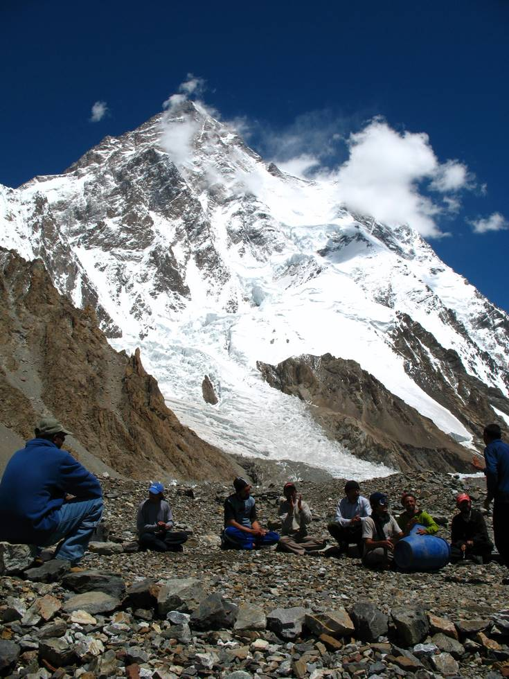

K2, K2.

## Comments (3)

**Imad** - August 12, 2007 10:28 AM

You lucky buggers!!

**Sadiq Shah** - February  2, 2008  2:51 PM

I have the same passion... Wow...CONGRATULATIONS, you make me proud:))) I would most certainly like to meet you guys if its okay and possible?
My contact info is given below:

Sadiq Shah
M.D.
For Himalayan Travels & Tourism (Pvt) Ltd.
Direct No. 0300-8226418. 0333-2129870
Phones: +92 21- 4813707 4971615 5443335-6-7. 8353725
Fax # +92 21-4814834
E-Mail: himaliyan@cyber.net.pk & hgat.tours@gmail.com
Website: www.travelstourism.com
Address: Suit No. 205, 2nd Floor, Gulshan Trade Centre. Block No. 5, Gulshan-e-Iqbal, Karachi-75300, Pakistan.
(Near Gulshan Chowrangi just above Telenor & TCS offices)

**safdar khan hunzai** - March 12, 2009  1:53 AM

thank u for ur services and a message to all hunzai peopls please dont black mail to allamah nasir u din nasir hunzai because he is a sufe scholor of ismaili world thank u

