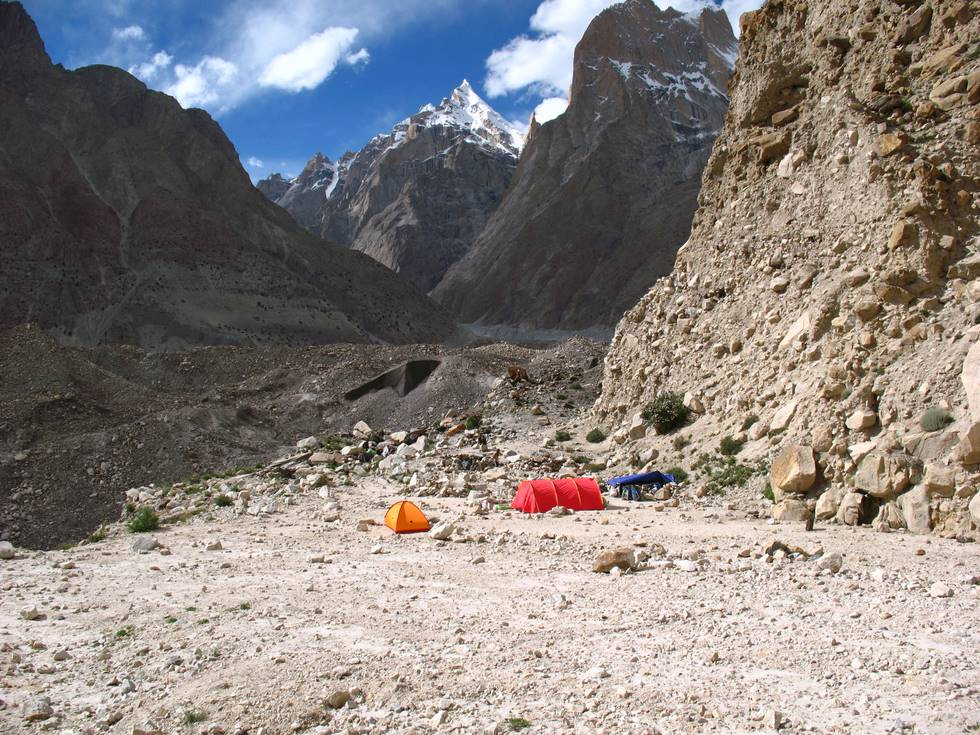

We camped overnight at Liligo. This campsite is now abandoned - groups go from Paiju to Khoburtse, or all the way to Urdukas and camp there. The orange tent is of a lone Spanish hiker, who unlike us was carrying 32kg of weight. He had more muscle than bholu pehelwan