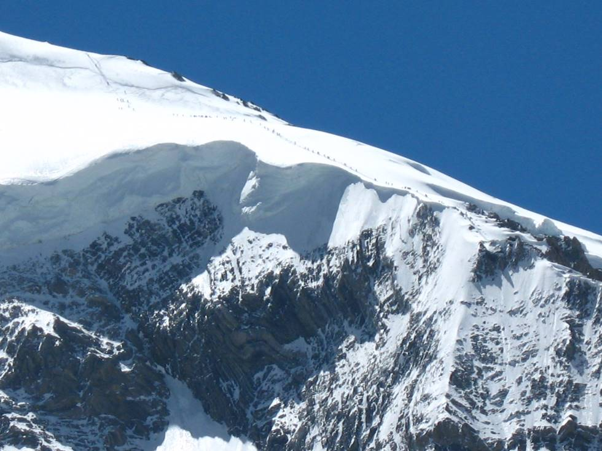

There were 25 or 26 expeditions camped at base camp when we visited, and though over 250 climbers were attempting to summit, most of the expeditions turned back due to bad weather.

## Comments (1)

**Irfan ul haq** - March 11, 2012 12:04 PM

rare

---

