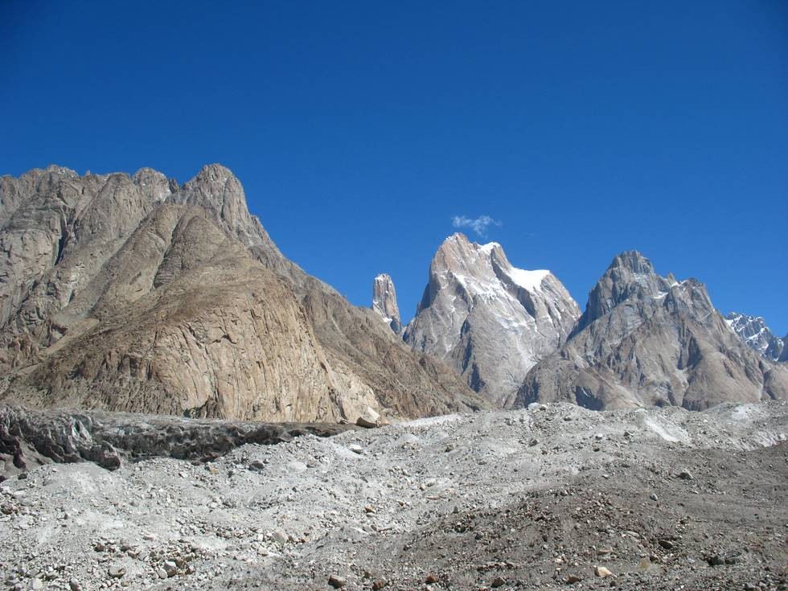

Trango towers is visible between them.

## Comments (3)

**Imad** - August 12, 2007  9:56 AM

Trango Towers?? I thought there was just one

---

**Yaseen** - August 12, 2007  8:06 PM

There are indeed 2!

---

**Ahsan** - August 12, 2007 10:15 PM

No, there are several of which three are the best known - Great Trango, Nameless Tower and Trango Castle. There is also Trango Ri, Monk, Pulpit etc.

---

