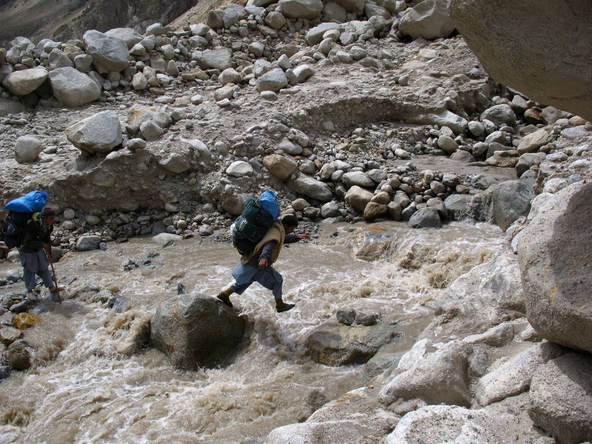

This was a tricky one! You had to jump from one slippery rock to the other, while trying not to fall into the river. Which Asad managed to do (more than once)...

## Comments (3)

**KARAM TALPUR** - December 18, 2008  1:17 PM

IDHAR NAHEEN GIRE TO PHIR KIDHAR GIRE

---

**Adeel** - December 22, 2008 12:37 PM

Is tarha ki situations main aik baat zahin main rakhni chahiyee "its OK to fall" :)

---

**Adeel (Wrangler)** - December 23, 2008 11:07 AM

Hmmm...there is another Adeel writing comments, so v'll have to identify which Adeel's comments r there.
Cheers.

---

