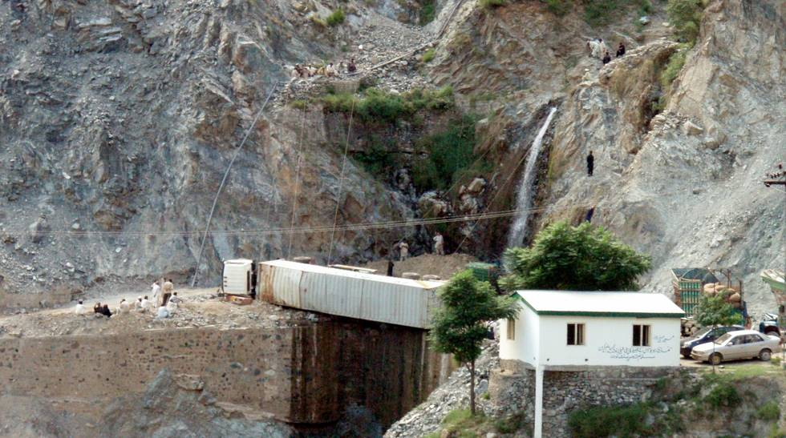

It tried to take the curve too fast and ended up on its side.

## Comments (10)

**Imad** - August 12, 2007 10:41 AM

jackass big rig driver... are they using ropes to pull it back up on its wheels? It's a miracle it didn't wind up in the river down below!

**Yaseen** - August 13, 2007 12:47 AM

Just a tad bit more and it would have definitely been "Curtains" for this one.

**KO** - August 13, 2007 10:36 AM

They're using steel cables and pulleys to stop it from sliding in the river - in this picture they had already pulled it in a few feet in to the road.

**Faizan Haq** - January  4, 2008  4:40 AM

stunning album! i'm going this year!

**Mike** - August 12, 2008  5:37 PM

Amazing photos. It looks like it was a great trip. I'm jealous.

**aamir sajjad** - April  5, 2009 12:52 PM

Very well captured and ..captioned. Great site. Job well done.

**salman** - June  2, 2009  1:26 PM

papooo yar kia picture

**sam** - January 13, 2011  6:31 PM

i thoroughly enjoyed the album... thanks for sharing and all the best for future ventures...

**Yousuf** - February 21, 2011  3:47 AM

What a great group of pictures. Looking at them one feels like it would be a shame to depart this world without visiting heaven that is on earth. Good job guys and all the best for your future trips.

**Omar Zaman** - May 25, 2011  9:09 PM

Most spectacular. The Pictures are absolutely stunning. Must have been a great adventure. Thoroughly enjoyed seeing the sights and experiencing the place as if one was there.

