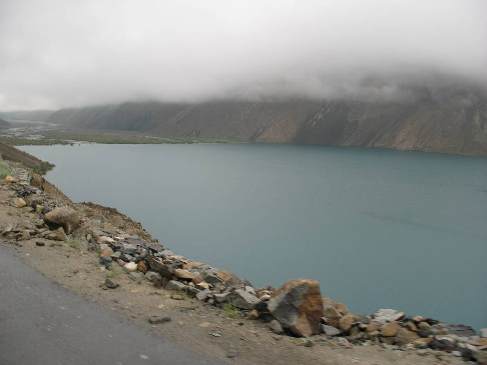

On the way to Deosai plains. Our guide Baqir is also a resident of Satpara lake region. There is lots of good trout swimming in this lake and the government has been constructing a damn since 2002. The Chinese company that has the construction contract is paying good money to the labourers and a lot of former porters have started working at the damn site. This is causing a shortage of porters-