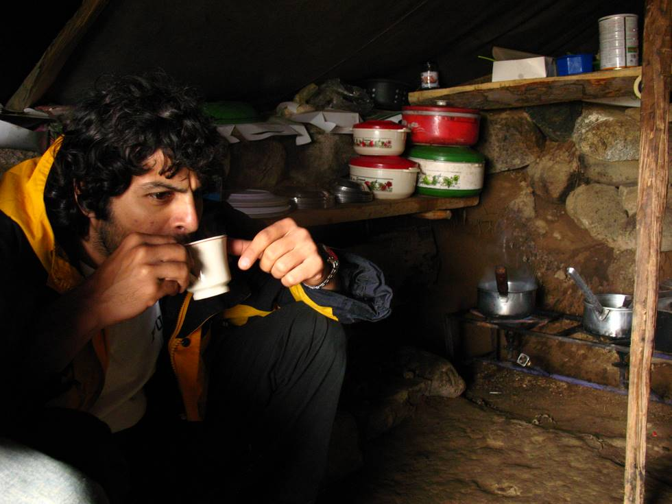

There is a chai shop in a tent at Bara Pani. It was quite cold, so we were all glad to huddle into the tent near the stove. As usual Khizar looks like he's thinking about something deep, but it is just that he's really concentrating on his chai and food. Let nothing come in the way of Khizar and his food. He's dangerous when he's hungry

## Comments (1)

**khizar diwan** - December  2, 2008  3:35 PM

hahahaa! true true.. the jeep ride into deosai was so bumpy that it made my hair curly

---

