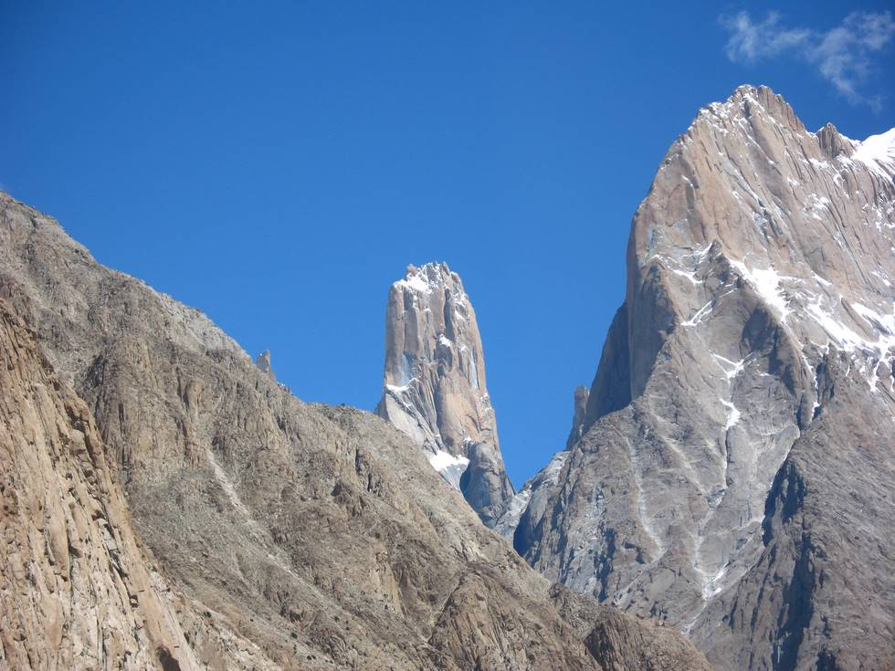

One of the three towers which are the Trango towers, one of the most difficult and challenging rock climbs in the world. We met a Mexican climber (Carlos) and his Pakistani climber (Ali) at our hotel who had just completed a new route up the Trango.