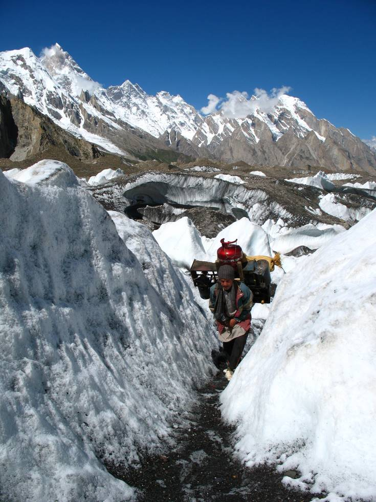

## Comments (5)

**khizar** - August 18, 2007 12:02 PM

These porters are carrying more then 25 Kgs on their backs. And still they walk fast. Actually what I did on the 7th day, after getting a bit acclimatized, was that, I started walking on their foot steps. And what I got to know was that, they actually walk sensibly. They know how to save their energy. They take steps correctly. Because they are use to this. And they dont even have gripping boats.

---

**AO** - August 18, 2007  4:22 PM

Khizer, what were you doing with a gripping boat?

---

**KO** - August 18, 2007  4:42 PM

The height does strange things to people... but what he probably means is that the porters have regular shoes, not hiking boots with a Vibram sole.

---

**Khizar** - August 18, 2007  4:48 PM

Spelling mistake: Boots!

---

**Yousuf** - February 21, 2011  3:04 AM

Was there a weight limit on porters to how much they can carry?

---

