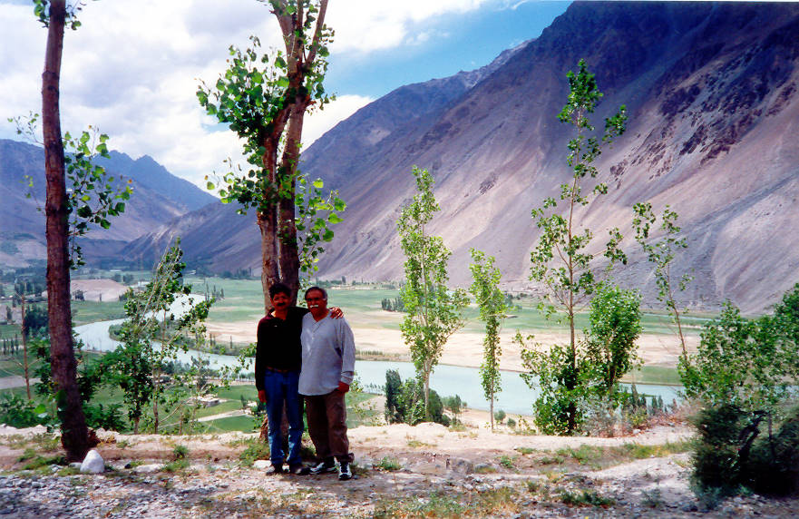

Standing in front of a little bit of heaven.

## Comments (4)

**Ahsan** - June 18, 2005  8:48 PM

Where was this picture taken. I took a picture at exactly the same spot about 10 years ago, but can't remember if it was in Ghizr or further along in Yasin. We only spent a night at the rest house and then drove back to Chitral via Shandur, but the name if the village has completely slipped me. The color of the river was stunning.

**KO** - January 24, 2006 10:12 PM

This is somewhere in between the 1st and 7th heavenly place! So we also cannot exactly tell you where it is.

**MB** - March 23, 2010  5:09 PM

From this view I guess this is Phundar (Fundar) , 5-6 hours from Gilgit (depending upon your speed)

**Wrangler** - April 13, 2010  5:53 PM

@MB, I think u r right. I visited this area some 20 years back and this seems to be the Phander lake area that falls between Teru and Yasin valley.

