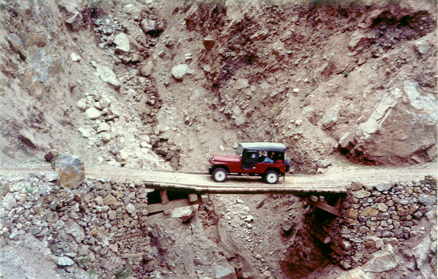

Bridge? What, that!?: Just a glimpse of the drive from Raikot Bridge to Tatu. Photo by Salman Ali.

## Comments (2)

**tom** - August  1, 2006 11:53 AM

nice looking cj-6. what year is it?

---

**Sasha** - April 29, 2012  1:25 AM

I share this to make all of you laugh at me. This is intentional. It gives me great stfasiaction to see an individual become like a rockhard erection before it gets cleanly sliced off by a Shogun blade. I am a big advocate of trial by fire. Have at it ;-)April 2010: Bilderberg hopes to keep the global recession going for at least a year, according to an international financial consultant who deals personally with many of them. This is because, among several reasons, Bilderberg still hopes to create a global “treasury department” under the United Nations. Bilderberg first undertook this mission at its meeting last spring in Greece, but the effort was blocked by nationalists in Europe and the United States. Nationalists objected to surrendering sovereignty to the UN. The global elite are conspiring to send oil prices crashing through the $200 dollar a barrel mark as part of an organized agenda to hike profits, bring about a global economic crash and torpedo the middle class, and they're not afraid to attack Iran as a means of achieving their goal. By pushing peak oil theories and tying them in with the man-made global warming fraud, Bilderberg seeks to jack up oil prices to the point where the living standards of the middle class become unsustainable and the west is lowered into second world status while elitists reap the financial and political bounty. A military attack on Iran is also essential for the globalists to kick-start an economic collapse coupled with a massive hike in oil prices. French Foreign Minister Bernard Kouchner told a French TV station yesterday that the world should prepare for war with Iran as rhetoric around the possibility of conflict grows bellicose. Experts have predicted that should an attack occur, Iran would immediately cease oil exports, pushing the price per barrel well beyond $100 almost immediately, inflating gasoline prices and kicking off a worldwide energy crisis and a recession. From June 2009: Depression or a prolonged stagnation? (Stated as such in the pre-meeting booklet sent out to attendees.) Bilderberg is looking at two options: Either a prolonged, agonizing depression that dooms the world to decades of stagnation, decline, and poverty or an intense-but-shorter depression that paves the way for a new sustainable economic world order, with less sovereignty but more efficiency. Rate this comment: 0 0

---

