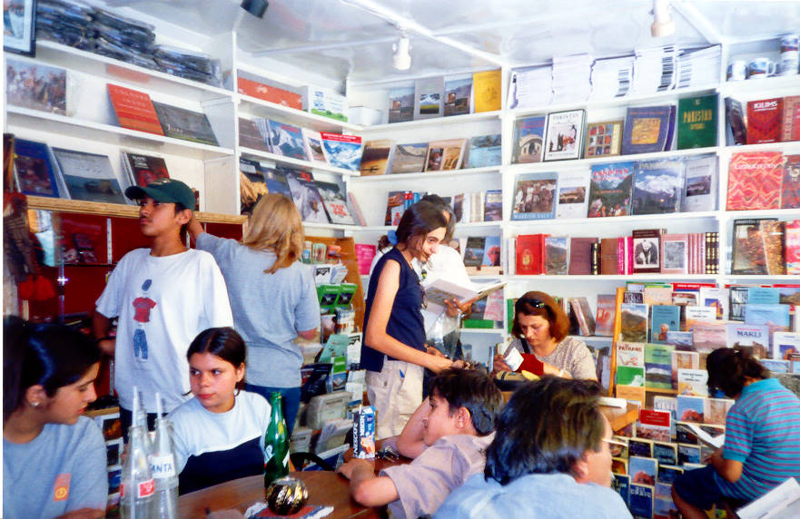

A thoroughly western cafe in Hunza. The only one of its kind in Pakistan, where you can go sit, drink coffee and read. They have good snacks also. Everyone going to Hunza ends up coming here. Highly recommended.

## Comments (3)

**patricia** - July 17, 2003 10:55 PM

What was great were the books & you could mail your postcards from here!

**Asif** - April  9, 2006 10:15 PM

Nope..its not the only kind there....go Karachi..

**akhter** - February 19, 2010  6:04 AM

wow hunza is best really i miss my home place.....and read one too.......

