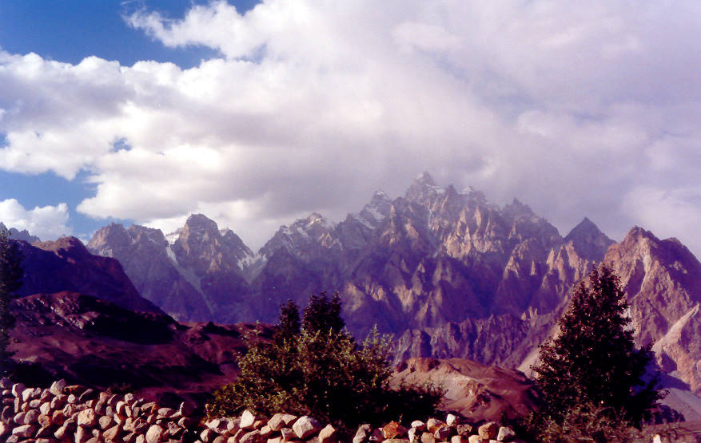

These jagged peaks are located enroute to Gulmit from Karimabad. Hunza valley

## Comments (3)

**Mullah Maghribi** - May 22, 2004  3:02 PM

Aarae bhayya agar ye jannat ka nazzaara hae to hooron ko darakht ke peche kyun chupaa deya...... deedaar ko karne detae....

**Bazal** - July 25, 2004 11:29 AM

Truly Breathtaking!

**Zain** - April  3, 2005  8:09 AM

Wow, only If there was an International class lodging facility, or touring hotel around this place, a perfect spot for honeymooners

