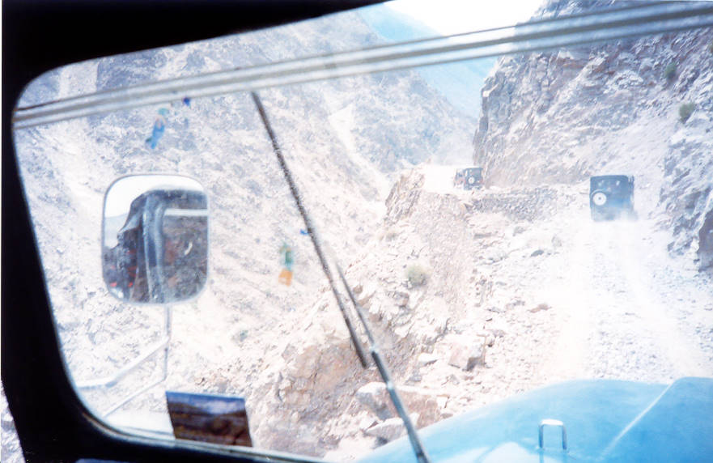

This is a picture of the Jeep drive from Raikot Bridge to Tatu, before our trek onwards to Fairy Meadows. The Jeep ride was very enjoyable and memorable to most and terrifying for some as this picture shows. At a couple of points the Jeeps had to reverse to negotiate the tight hair pin bends. The track is so narrow, if a Jeep approaches from the other direction, one Jeep has to squeeze to the side of the hill while the other precariously navigates around it with two wheels practically hanging over the edge.
The report from 2003 is that rain and ensuing landslides have washed the Jeep track away. Now you would have to walk all the way from Raikot Bridge (height 2000 feet) to Tatu - a difficult and hot 5 hour trek.
|
of |
Posted on June 21, 2003 in Khunjerab 2000 #

## Comments (4)

**Imad** - July 30, 2003  7:27 AM

Correct me if I am wrong but isn't Tatu at 6500 feet? I am pretty sure Fairy Meadows is at 11900 feet. Hiking to Fairy Meadows from Tatu was tough enough, imagine starting out at Raikot bridge. Some people might break into a chorus of "Where have all the mules gone?" (my apologies to Trisha Yearwood).

---

**Nasir Ghaznavi** - November 11, 2006 12:36 AM

No Fairy Meadows is at 10,500 Feet(The first camp site) and Tatu - the point where you leave the jeeps behind is at 7500 feet.

Also the road washes away from time to time but is rebuilt.

---

**Kurt Langland** - October 18, 2008  5:22 AM

The road washes out or collapses several times a year. Out trip in 2007 had two sections that had failed and required transferring jeeps. By the next day one of the sections had already been repaired by a group of about 20 men.

---

**Kurt Langland** - October 18, 2008  5:22 AM

The road washes out or collapses several times a year. Our trip in 2007 had two sections that had failed and required transferring jeeps. By the next day one of the sections had already been repaired by a group of about 20 men.

---

