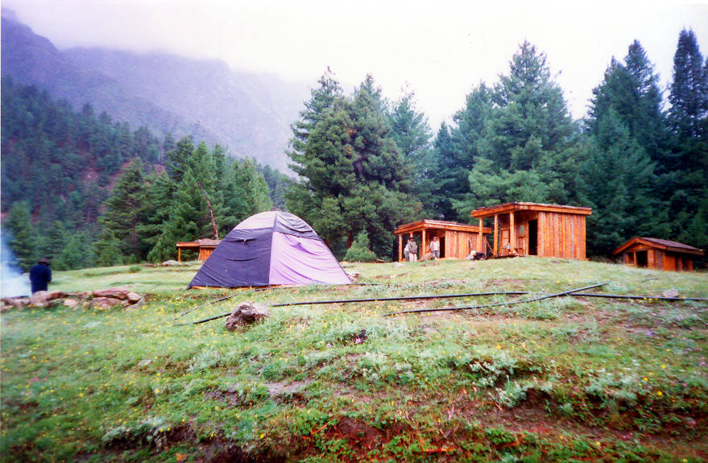

This is our resthouse/hotel/campsite at Fairy Meadows.

## Comments (34)

**patricia** - July 17, 2003 10:41 PM

Ah! this was where the soup made of "meat & bones of some thing" tasted divine the first night we ate there!

---

**KO** - July 17, 2003 11:19 PM

According to some, that soup consisted of toads not goat!

---

**Imad** - July 30, 2003  7:35 AM

Even toads couldn't taste that foul or be that tough. My vote goes for specially imported roadkill. Could have been a possum. Nasty hairy critters, kinda like a clumsy rat the size of a small dog. Them hicks in the hills here will eat them. Squirrel guts, yummy!!

---

**patricia** - August  1, 2003  5:34 PM

At that point in time, we felt anything goes!

---

**Arif Masood** - August  9, 2003  2:28 AM

4X4 Club,
Congratulations... This is great stuff and u all have iam sure put a lot of effort in this.I wish I was there to be a part of this.
Good Luck
arif

---

**Kiran Omar** - August 11, 2003  7:36 PM

Offroaders club, congrats to you on the great job! Its an exciting and interesting site. Makes one proud to be Pakistani! Ours is indeed a diverse and beautiful country. Keep it up, looking forward to following your new trips and adventures......even tough they might involve consuption of "squirrels"?! Happy off-roading!

---

**Imad** - August 13, 2003  8:25 AM

Just to clear things up a little bit, when I said "them hicks in the hills here..." I wasn't referring to the people who live in the places we travelled to. Rather, it was a reference to the rednecks and country bumpkins you might find in the backwoods of the southern US. Of course, we all know nobody back home eats squirrels (at least I hope no one does).

---

**Yellowrose** - August 13, 2003  3:38 PM

I'm sure this group of travellers have tried all sorts of creepy and crawlies palatable, cooked with dextirity by the old man, locust salad, toad and squirrel soup...... yummy.

---

**Kaz** - October  4, 2003 10:48 AM

Hi there. Please tell me more about Fairy Meadows and how was your experience there. How would you describe the scenery there. I live in the USA and thinking about visiting Fairy Meadows in a few months. The place looks really beautifu.

Thanks
Owais....

---

**Imad** - October  5, 2003  3:12 PM

I think this calls for a write up on the trip to Fairy Meadows. In a nutshell, Fairy Meadows is an alpine meadow nestled away in a mountain range where pretty much nothing grows. Since the place is so lush and green, its existence in such an arid region seems like the stuff of fairytales, hence the name Fairy Meadows. Nestled away at the base of Nanga Parbat, Fairy Meadows is only a few hours trek away from the base camp. The Raikot Glacier, which ostensibly originates at Nanga Parbat and flows down the valley towards Fairy Meadows, is also visible from here. Expect to find a lush green forest replete with quaint little brooks and streams criss-crossing their way through. A fairly large plateau also doubles as a polo ground and cricket ground too. Log cabins are available for rent as are campsites if your prefer roughing it out in a tent. As you might imagine, food and drink are quite expensive up here. Besides kicking back and simply taking in the majestic beauty of this place or watching Nanga Parbat turn hues of pink and orange as the sun sets, Fairy Meadows is also a fun place to explore. However, the forest is dense and the weather changes very quickly, so it is best to stay in groups and wear adequately warm clothing. The dense growth can also cause disorientation, with the result that one may not know which direction to head in. But we all know better than to head too far out in unknown country right?
Fairy Meadows was accessible from Raikot Bridge mostly by jeep with the last few kilometres either on foot or muleback, but rumour has it that last year's rains washed the jeep track away. Hence, it's accessible only by foot now. I can't remember how many hours the trek takes though. I do remember it tooks us 2.5 hours from Tatu onwards. Correct me if I am wrong, but the trek from Raikot Bridge to Tatu is 'supposed' to be a 7 hour trek. Somebody might want to chime in on this...

---

**kaz** - October  5, 2003  8:05 PM

Wow! Sounds like an awsome place. Pakistan is really beautiful. I did not know that before but after doing some research, its probably one of the most beautiful.

How about all the stuff about destroying the forest in Fairy Meadows by loggers? Is that true? Why don't people take care of national treasures like that?

---

**KO** - October  5, 2003  9:11 PM

It took us more than 3 hours from Raikot, not 2.5. You must have been on a horse. It's a eight hour trek from Tatu to Raikot, and yes, the jeep track has been washed away.

About the logging, there was some action taken to stop it. I'm not sure about the details.

---

**kaz** - October  6, 2003  6:55 AM

Thanks guys for answering my questions. This is really interesting to learn about this area.

So tell me, when is the best time to go to Fairy Meadows? How long should a good stay be to see everything? Is it nice up there in winter?

---

**Imad** - October  7, 2003  5:46 AM

Oh yeah it definitely took over 3 hours from Raikot Bridge. The 2.5 hour trek I mentioned was from Tatu to Fairy Meadows. I got there in right around 2.5 hours (can't remember who else was with me), mostly because we took a couple of shortcuts that involved going straight up the hillside rather than around it. Yaseen and Siki (maybe also Nick) were the quickest I believe, getting there in even less than 2.5 hours. On the other hand, it took some people almost 4 hours. It all depends on how often you stop and what kind of pace you keep. Too fast and you'll quickly tire out, too slow and it'll take a lot longer.

---

**Salman Ali** - October  8, 2003  1:58 AM

The climb up from Tatu to Fairy Meadows is one of the most grueling treks one can ever do in Northern Pakistan. Although it is only a 4 kilometre long hike, it also entails a rise in altitude from about 7000 feet to 12500 feet (above sea level).

All the cigarettes I had ever smoked and all the excesses of my misspent youth came to haunt me in the shape of breathlessness and fatigue, yet I carried on, because in between gasps of rarified montane air I could see Winston Churchill on top of Nanga Parbat, exhorting me,"Never, never, never give up..."

And I thought there would be fairies serenading us.

---

**tasawar ul karim** - October  8, 2003  6:18 PM

hi offroader,
you people had tremendous job and i am impress indeed by your work. i love nature and really curoius to visit northern pakistan, places like fairy meadows and i love to come pakistan for this purpose,here is USA we miss the nature alot so i need your guidance to make my visit wonderful so do guide me, thankx

---

**Raheel** - December 25, 2003  8:41 PM

In last winter major earth quake hit the diameer valley, wiping off the Raikot-Tatu Trek. Its around 9 hour trek from raikot. Once Herman Bauhl, the first climber to summit Nanga parbat said about this trek "It is the most horrible trek of my life".

The heat, no shade and no water type trek can take your breath away if you are not well prepared for it.

So, if you have no trekking experience then wait till FWO make that road clear. When ??, i don't know may be in next summers.

---

**tanya** - February 26, 2004 11:06 PM

the food actually tasted quite out of this world the first night... :P

---

**Yaseen** - March 13, 2004  1:50 AM

Well well...looks like we have quite an interesting forum here on "Fur Mudou". Why not make a boys trip there this summer?

---

**kO** - March 13, 2004  2:18 AM

This picture looks good... it really must have seemed like a fairy meadow to the poor german hiker who made it all the way from Chilas!

---

**Aneela** - June  5, 2004  9:10 AM

We are university students planning to go to fairy meadows next week most probably we dont have any experience so i would appreciate any advises from your side.
I am confused what is washed away do we have to walk all the way from raikot to tatu??and then from tatu to fairy meadows???

---

**Raheel Ahmed** - June  5, 2004 10:18 AM

Good News from Fairy Meadows (North face of Nanga Parbat)!!

Road from Raikot Bridge to Tatu has now been opened for jeeps.

So, all the folks who want to see the Majestic beauty of Nanga Parbat this summers can avoid the walk from Raikot bridge to Tatu by having a jeep ride. Yet, they still have to walk from Tatu to Fairy Meadows (around 3 hours). But thats not a problem !!

---

**Raheel Ahmed** - June  5, 2004 10:27 AM

Here is the email sent by Rehmat Nabi: (a local of the area)

---

**Ammad** - July 15, 2004  9:33 AM

How Long will it take to hike from Raikot Bridge to Fariy Meadow? What is the Distance in KM approximately?

---

**KO** - July 15, 2004  6:12 PM

See the [forums](http://www.offroadpakistan.com/forums/index.php?showtopic=45) for more information about fairy meadows, and an answer to your question.

---

**Ghulam Nabi** - August 26, 2004  2:09 PM

Dear Offroaders
It gives me immense pleasure to see these wonderful pictures with detailed info on Fairy Meadows. I also highly appreciate your concerns regarding the pressing issue of deforestation around Fairy Meadows. We all need to raise these concerns at all levels to preserve the pristine beauty of these legendary areas. Keep up and do let me know if you guys need any help in the Northern Areas.

---

**malik wasif** - October 23, 2004  9:30 PM

salamz hi to all well i have been to fairy medows and after seeing ur web site and pics i really start missing that trip u ppl did good job to make a web site of this place u ppl have done nice job no doubt keep it up

---

**avtar** - February  3, 2005 10:02 PM

is march very early in the year to trek around fairy meadows?

---

**Zaina Anwar** - June  2, 2005  8:44 PM

On 18th May,2005 my partner and I trekked up to fairy meadows.Because of heavy rains most of the jeep track had been washed away,and so we were dropped off at the sight of the first landslide only a couple of kilometers from Raikhiot Bridge.From there we walked all the way to fairy meadows.Innumerable landslides and blisters on my partner's heels presented us with difficulty.Besides that it was raining.But when we reached the meadows,the first glance at the mountains was sufficient to make us fall in love with the place.Mr.Aziz and the rest of his team were incredibly hospitable.An enchanting experience.

---

**Raheel Ahmed** - June  3, 2005  2:40 PM

Thank you Zaina Anwar. Your information about the trek will really be very helpful for those who are planing to visit Fairy Meadows this Summers !!

---

**eram** - June 16, 2008  4:51 PM

me had a great advanture at Fairy Meadows...miss watching nanga perbat from there espacially at evening...u guyz do visit it its truly an advanturus place...gives a peace that u wish in ur life!!..

---

**shahid saghir** - July  7, 2008  9:48 PM

I am planning my tour to fairy meadows on june13th, 2008. if anyone interested in accompanying could join in. If anyone like to share do and donts that will be appreciated.

---

**Memoona** - August 19, 2009  9:09 PM

Fairy Meadows is one of the most beautiful places in the world. We have been to the meadows this very month and have been very lucky to view some of the most incredible and awesome scenes of the majestic Nanga Parbat. Somebody has mentioned Mr. Aziz and I very sadly want to share the news of his sad demise two years back. Now there is a summer school for the the children of that area which is built to commemorate his sincere services for the people of his area. His Raikot Serai is now run by his two brothers Rehmat Nabi and Ghulam Nabi and both the brothers are doing a tremendous job. If u plan to visit the meadows I would suggest you should go to their camping site. It has been so beautifully and esthetically designed that even the bathrooms offer you the panoramic Nanaga Parbat with its adjoining Raikot Peak and Jiliper Peak. To go there you should have warm jackets, sweaters, trakking shoes and if you cant do without meat protein carry some tinned food and ready made meals, instant coffee and tea satches would be an instant relief from the freezing cold, soups and noodles are also not a bad idea. What you should not do in the meadows and in all of that area is DO NOT LITTER, as I have seen lager groups doing there and it was heartbreaking because students were doing it all around the place. My nine years old son picked a lot of that trash but it was much more than his small effort. Please be responsible and I would like to end my comment on a quotation that I read at the small hotel at Jeep point in Tatoo. It says :We do not inherit land from our elders but borrow it from our children.

---

**Q Hasan** - August 21, 2009  5:04 PM

I'm really fascinated reading all your comments. Thanks to everybody specially to Memoona for her detail and most recent tips.
I've a long awaiting dream to go to this beautiful place and planning to utilize the upcoming eid holidays to be there. If anyone is interested to join or anybody have any more good tips, would be grateful.

---

