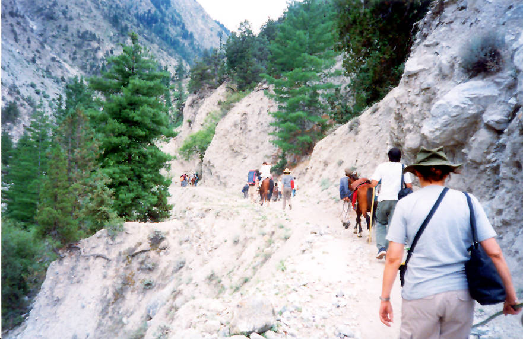

On the trail to Fairy Meadows.

## Comments (12)

**patricia** - July 17, 2003 10:45 PM

Longest trail on earth!

---

**KO** - July 17, 2003 11:14 PM

Well you'll be glad to know it's been washed away by rains and a landslide so no future travelers will have to walk it.

---

**patricia** - July 19, 2003  1:35 PM

Nanga Parbat will wait for US!

---

**Kabir Omar** - July 29, 2003 12:02 AM

.......But then someone said on the radio water bottles were behind the next big stones ....just few yards ahead of us...while we searched each stone, each corner every stump of tree......we were down right exhausted , blurry eyes, panting, gasping for air...decided there and then "I quit smoking"
but there was no water to be found. One just had to keep going.Will never forget this trail.

---

**tanya** - February 26, 2004 11:08 PM

there was no water cause i thought the bottle was kinda cute so i flicked it for myself :) (:

---

**Asif Naqvi** - August  1, 2006  3:29 PM

Five Year back, in 2001, i travelled to this part of the world.... it was a real fun....but i hink there was a massive earthquake and TATU was destroyed.....i never knew the fate of this trek....i wish if any anybody recently travelled on the same can come up with whats latest about this trek???

---

**Arslan** - August  1, 2006  7:19 PM

I love that type of place.

---

**sajjad ali** - May 28, 2007  6:03 PM

nanga perbat so beautiful i can t explain my feelins................

---

**Sha Chaudhary** - May 24, 2008  3:29 PM

The drive to jeep stop and the trek is open now. It's a long, long trek to the fairy meadows!

---

**ASK** - March 31, 2010  5:44 AM

I remember every Step from Raikoat to Nanga parbat The Killer Mountain's first view

---

**bhangoo** - April 30, 2011  5:27 AM

the trek is as good as it was. i just visited fairy meadows and witnessed the horror of nanga parbat. its beautiful, adventurous and breath taking on every next turn you take

---

**Aziz** - December  6, 2011  7:57 PM

ya guyz its really horror travel but some one up their says that TATU is destroyed ,,,,its not real i went their in this September its safe and able to go their

---

