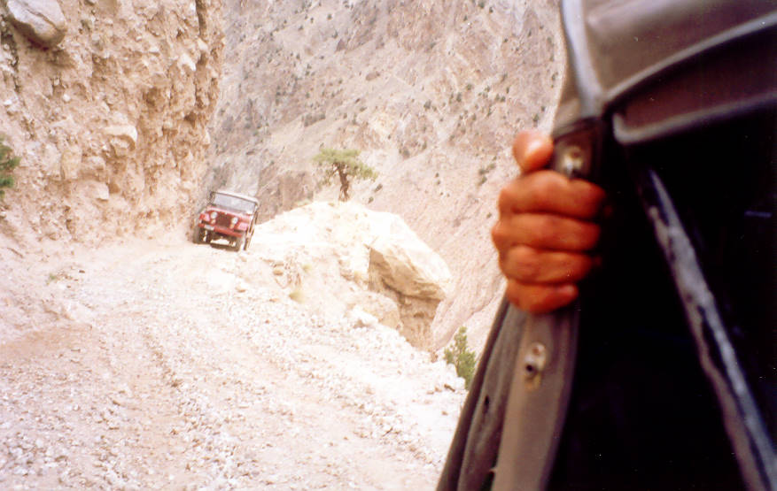

A case of sheer white knuckles! This track cut into the mountainside had a drop of nearly 3000 feet to the bottom of the gorge. Enroute to Tatu from Raikot bridge.

## Comments (1)

**Imad** - July 14, 2003 12:37 PM

The only way to complete this journey, maybe even enjoy the hair raising ride like certified nuts that some of us are, yours truly included, is to surrender your fate to your Maker and hope he has blessed the driver with the skill to negotiate the track. Then you can kick back, or hang like a monkey out of the Jeep if you want, and enjoy the majestic beauty of this land.

---

