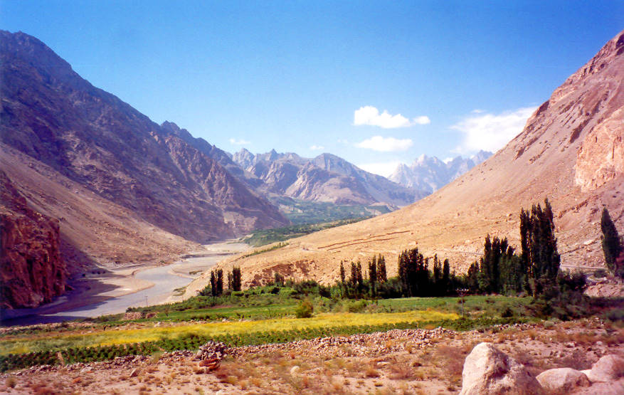

A gorgeous view of the Hunza valley.

## Comments (37)

**patricia** - July  3, 2003 11:54 PM

Is this for real? You better believe it!

**Nighat** - July  4, 2003 10:22 PM

This is where I want to live and die. with not a soul in site and I am sure I will make it to over 100 years!

Can one build a small hut there?

**Ameena** - July 24, 2003  2:50 AM

WOW! Is this where we're going next summer?

**Dr Sal`** - July 26, 2003  8:51 AM

Dr Sal likes Hunza valley

**iqbal** - November 15, 2003  9:21 PM

i love this place ,what a snap

**aziz** - August 27, 2004  5:54 AM

Have never seen this classic snapshot before. Ayeenabad, Nazimabad and Gulmit at the far end. The only pic of its kind. Bravo.

**jamila** - November 28, 2004 12:12 PM

khuda karay ki meri sarzameen hunza sada aabad rahay.(aameen).n i love very much my hunza.

**shahnawaz** - December 14, 2004  9:01 PM

hunza my love my hart,hunza is my motherland and every one of us must visit hunza one time in a life because hunza is full of nature

**Zain** - April  3, 2005  8:18 AM

The Americans think they have the best of the best, in terms of everything (land and people), but they obviously have missed Pakistan. MashAllah, Pakistan is by far the best Nation in the World. Both its land and people.

**Zain** - April  3, 2005  8:22 AM

I lived most of my life in America and visited many places, but never seen anything close to what we have in our homeland of Pakistan. We need to appreciate and take care of our motherland and its people the best way possible. The God Almighty has blessed us with such beutiful country and the people are also one of the most hospitable and courteous. Pakistan Zindabad. May Allah bless our nation even more. Ameen

**ASIF IQBAL** - April 15, 2005  4:14 PM

HUNZA IS BEAUTIFUL SITE TO VISIT.I LOVE TO VISIT PAKISTAN'S NORTHERN AREAS.

**Sajjad Hyder Mala** - April 23, 2005  6:49 PM

Heu U it is really a great gift of God for all of us that he giftes us such a beatiful Land which is a Heaven on the earth..
I want to say some thing to my valle.......
if there is any beauty in the earth,,,,,,,,,
if there is any charm in the earth,,,,,,,,,
if there is any mazaaaa in earth,,,,,,,
that is only HUNZA............

**Sajjad Hyder Mala** - April 23, 2005  6:50 PM

Heu U it is really a great gift of God for all of us that he gifted us such a beatiful Land which is a Heaven on the earth..
I want to say some thing to my valle.......
if there is any beauty in the earth,,,,,,,,,
if there is any charm in the earth,,,,,,,,,
if there is any mazaaaa in earth,,,,,,,
that is only HUNZA............

**Zulfiqar Ali** - April 23, 2005  8:56 PM

Hi I am Zulfiqar Ali Hunzai. I am really so happy to read and see that its so much.The Valley of Hunza are very nice and I love my Hunza very Much, and I shall love it any time. ok

Wiht best wishes
Zulfi

**ANWAR** - June 18, 2005  2:01 AM

Hi.i am Musharraf I LOVE THIS VALLY.This is a Heaven . I LOVE PAKISTAN I MISS PAKISTAN

**Imtiaz hunzai** - June 21, 2005  3:34 PM

i wana say one thing to people of hunza that dont forget your own nature, culture, language and the most importent thing (for students) is, dont forget your objective to be in cities you have to set one thing in your mind that you have to
return to hunza one day and there must be postive change in you when you go back to hunza so that this postive change will bring happiness in your families and in people of hunza. thanks.
love you hunza.

**Jalal Haider** - August  5, 2005  1:51 PM

Very nice pic. also its quality is very good. I Love Hunza

**Ahmet** - August  5, 2005  2:45 PM

I want to speak with a person living or originary from Hunza because i've read that they speak a language that is not so different that albanian. Who can give me a phone number that i can call ?

**kareem** - March 10, 2007  9:22 PM

hunza the great!!
hunza is great ya missing too much ya

**Ilir** - April 18, 2007  2:23 PM

hello to everyone.
i would like to go one day and visit this wonderfull place and the most important the people that are originaly from illyria (Albania today)

**Iliri** - April 18, 2007  2:31 PM

The story of Hunza people is very interesting. Read this. "I became a friend of the Church's Council and after some days one of the church advisors called ç©«o phones me to let me know about their difficult position. During the conversation he told me that he found that I was interested about the history of Albanians and he wanted to show me what his father or his grandfather had told him. He told to me that his father had graduated at the Cairo University and as a student he went for a walk together with an Albanian student. A student of another nationaliy joined them too, their friend. While, they were walking they spoke in Arabic language. When they had to talk about something that was secret they spoke in Albanian in order not to be understood by their friend. Their friend kept quiet and when they finished the conversation he told them that he understood everything, and that he speaks that language too. Two Albanian students remained amazed and asked him why he didn't tell what he had studied Albanian language. He swore that he had never studied Albanian, but that language was spoken in his birthplace. They told him how could be spoken the Albanian language there; that he came from the cursed devil in Pakistan near India. He esplained them that his country was called Burria(men)(Burushu) and surely all of them were burria (men-soldiers) of Alexander the Great. The two Albanian stubborn students didn't believe to him. The boy became nervous becouse they called him a liar. He wrote to hsi father that when he will buy him the ticket for sumemr holidays he wanted to take two of his friends from the university who were speaking Albanian language. So, two Albanians went on summer holydays together with their friend in the place called Burria and when they arrived there they remaned senseles when they realized that they were speaking Albanian Langauge(surely in dialect). The boy's father since he was the Governor of Burria accepted them with a lot of pleasure and explained to them many interesting things and told to them that beyong the monuntains on the Indian part live our people in a place calles Kaushet(Qaushet).
I think that they didn't settle there after the murder of Achilles(Cleats), but they remained there when Alexander the Great decided to come back from India to Babylon and older soldiers who were Phillip's soldiers, bedore leaving he asked them to go through Hindu Kush, an easier way for older people. Whereas he left himself, Petale, India, through the desert of Makran, a very difficult and dangerous road. Whereas half of the army leaded by Narkos was aksed by him to go through the Indian Ocean, thinking that he will be connected with Nile and will come out in the Mediterranean Sea. I think that those who were sent through Hindi Kush about six thousand soldiers stopped in actual Burria. But, it is not sure yet becouse Alexander in order to protect the rear of the supplies he left many of his soldiers as in Baktria and in any other fortress. Burushu could be any of those soldiers

**Driton** - May  8, 2007  5:55 AM

HI im Driton from Kosova Irealy like this Picture but im more interested about the history of Hunezas in albanian means small nous and ok same id like to contact with any of hunzas because i hurt that ouer language don't difer a lot maybe we have a brothers from the other part of the world sow ill be pleasd that any hunzas contact me in my email tonii_lion@hotmail.com thank u good blase you

**Malik Maqbool Ahmed** - June 26, 2008 11:43 PM

HI im Maqbool Ahmed from pakistan Islamabad.

Huza valley is the best totaly natural for Huza tour please contac
00923325293244
0092512253928-2854889

**aziz barcha** - July  8, 2008  7:37 PM

waw such a fabulous pic. i LoVe U my HuNzA PaRaDiSe On EaRtH. LoNg LiVe LiFe. I HoPe SeE U SoOn.

**aziz barcha** - July  8, 2008  7:40 PM

waw such a fabulous pic. i love u my born place hunza paradise on earth. long live life.hope again see u soon

**maddy** - July 20, 2008 12:21 PM

hi i can't see any thing

**Adeel** - November  4, 2008 11:15 AM

Well I've been going to Pakistan's northern areas since I was a child. That developed the love for nature which probably is transferred to my children as well. I've been traveling in Pakistan's north on all means of travel including foot, offroad, car, motorbike, bus etc.etc. Though I've not traveled in Pak for the last decade or so but have done extensive travel outside Pak including UK, Canada, USA etc. etc. But I will vote Pakistan as the most beautiful country having all sorts of terrain.
Hunza valley becomes more beautiful if you hike around it. You get precious views from Ultar glacier and Ultar top.

**hajat ali hunzai** - April 11, 2009 12:38 PM

i love hunza.also azmat loves hunza,.

**saleem** - April 12, 2009 11:48 PM

hey...how do u say "i love u" in brushuski?

**Zulfiqar** - April 24, 2009  3:14 PM

very good q???????/

jaa une ka showl acha ba.

**hajat ali hunzai** - June 29, 2009  2:00 PM

hahah simply "un jaa but ayarum baa" .gr8 hunzai.

**ANILA** - August  9, 2009  5:41 PM

waw thats great;a comment on hunza.no words to explain its beauty,its loving people.;dil ki dadkan,sanson ka chalna tmhary dam c hy.tm c dor hain hm phr b hr pal tmhary sath hain.i love u.

**Adnam** - August 17, 2009 12:21 PM

i love hunza for ever

**haja ali hunzai** - November  8, 2009  2:26 PM

HUNZA..................................................................LOVE U MUCH.......................................................APNA GHAR AAKHER APNA HOTA HAI......MISS U..............................HUM TUM SE WAFA KARTEY AYE HAIN AUR KARTEY RAHENGEY,,,,,,,,,,,,,,,,,,,,,,,,,,,,,,HUNZA MERI JAAN .......................LOVE U.

**ali piyar** - March  1, 2010 11:36 AM

hi i am also belongs to hunza gilgit but since 2007 i havent visited my mother land i always love my mother land it is the only place heaven on earth with pure nantural environment LONG LIVE HUNZA GILGIT.

**ali piyar** - March  1, 2010 11:37 AM

hi i am also belongs to hunza gilgit but since 2007 i havent visited my mother land i always love my mother land it is the only place heaven on earth with pure nantural environment LONG LIVE HUNZA GILGIT.

**jimi** - February 28, 2011  8:39 PM

I been reading about the story of hunza northern pakistan has beautiful natyre and the most of the people of this region they are disedent of iliria albania today if is tru please contact me jim-kalasa@hotmail.com i'm albanian

