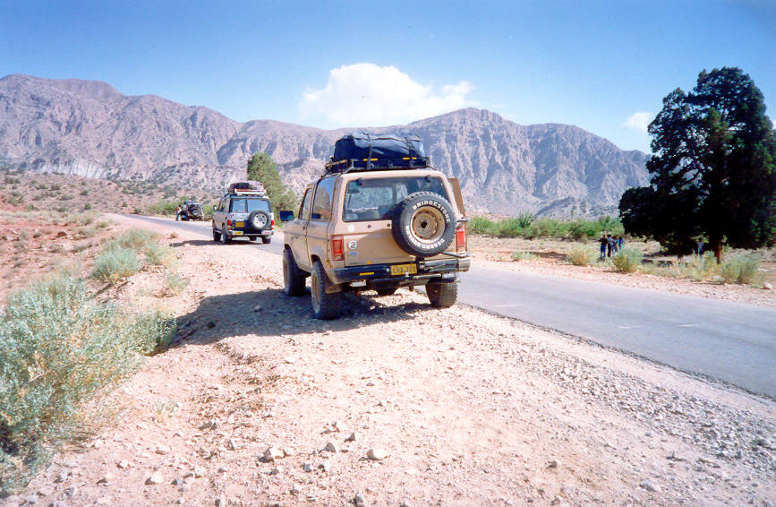

This is a 5000 year old juniper tree. It's one of the oldest trees in the world.

## Comments (7)

**Aleem** - July  9, 2003  9:50 AM

Really 5K years old tree? Does Guines knows about it?

**Viqar** - June 15, 2004  6:17 PM

As far as I know, the oldest living organisms are the oaks (not sure) in california...and those are not more than 4000 years old. The problem with the claim made by the locals in this instance is that you can't verify it by cutting down the tree and counting the the rings in a cross-section. However, I do not think that junipers live that long.

**Viqar** - June 15, 2004  8:17 PM

At the risk or appearing prudish, I would like to correct a comment I made above. The oldest living trees in the world are Bristlecone Pines..and not Oaks. Here is a link:
<http://www.wcsscience.com/oldest/thing.html>

The oldest juniper recorded so far was 2,675 years old...roughly half the age of the claim made here:
<http://users.ox.ac.uk/~arch0050/juniper.htm>

I hope I didn't get on anybody's nerves :)

**Imad** - June 16, 2004  2:29 AM

Although it is possible that the 5000 yr figure is optmistic hearsay, you are correct that there is no way to verify its age other than cutting the tree down. I think all of us here would rather keep guessing the tree's age before seeing it get cut down :)

**arif** - August 30, 2004 11:22 AM

can any body identify the exact location of this junniper tree at hunza or whereever it is located?

**Somar** - August 31, 2004  4:40 AM

This Juniper tree was the biggest we saw beyond Loralai, the Suleman range can be seen at the back.

**qainat** - May 15, 2010  2:13 PM

There is a way of reading a tree's age without cutting it down. It requires a bit of keyhole surgery. A long sharp metal probe is inserted into the centre of the tree and it cuts out a miniscule cross section of the trunk. On withdrawal of the probe, the light and dark section of the tree rings can be read and thus its age determined.

