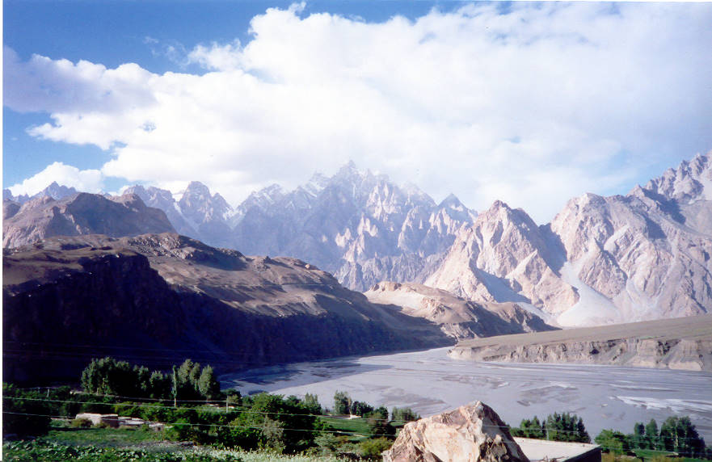

A vista of the view from above. That is the indus river.

## Comments (10)

**Moon** - June 28, 2003 11:14 AM

its gr8 to see the pics all were very nice i like this, its one of its own a really good pics gallery

**iqbal** - November 15, 2003  9:28 PM

i like this pic and others but all r saved in bmp which take enough space on disk.

**Ahsan Ali** - December  2, 2003  2:22 PM

Isnt this shot from Gulmit along the KKH? I could swear this is from that hotel's balcony right on the bank of the Indus with the KKH just on the left of this picture.

**Yaseen Ali** - December  7, 2003  3:21 PM

I'm not sure of the exact place where this picture was taken, but Gulmit is on the left bank of the Indus going North. The Cathedral peaks visible in the distance are before Gulmit, so I dont't think its Gulmit.

**Aziz, UK** - August 27, 2004  5:39 AM

this picture has been taken from Hussaini Village, (5 km) North of Gulmit.

**Yaseen** - August 27, 2004  4:54 PM

Well, maybe your right....I'm not sure any longer after 4 yrs.

**Arif Khan** - September  5, 2004  9:14 AM

It is a beautiful shot. You are invited to also see the photo I took from above Husaini while going on a trek to Gulmit glacier in July 2001.

<http://www.pbase.com/image/24428843>

Regards

**Imad** - September  5, 2004  5:26 PM

Great pictures in your galleries, Arif!!

**aslam** - March 11, 2005  4:30 PM

this is not the real pic of gmt ,it is taken from hussani....the cathedral peak of passu is not visible in it.

**Noor** - September 14, 2005  5:05 PM

This picture has been taken at Hussaini , Gojal.... the location probably is the ascending KKH after the four or five small bridges

