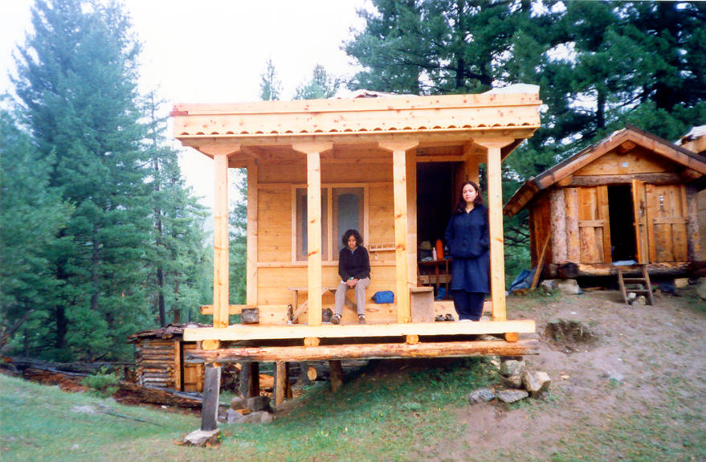

MO sitting at log cabin in Fairy Meadows.

## Comments (3)

**Imad** - July 30, 2003  7:31 AM

Log cabins for some, sleeping boxes for others. Seriously, I had to crawl in and out of the one I was in. Something like the one on the right but quite a bit shorter. Had me wishing I had a tent.

**Kabir Omar** - July 30, 2003 10:48 PM

……Well, quit complaining, the senior citizen get the plush cabins as seen above. As you go down the ladder in age you either land up in a shoebox, (that is if you are lucky) or open sky in freezing temps, bundled up in a sleeping bag near a smoldering fire. So you had a small cabin… you were lucky.

**Imad** - July 30, 2003 11:47 PM

Not complaining, rather just making an observation. I'm still partial to tents and sleeping bags since they capture the essence of camping.

