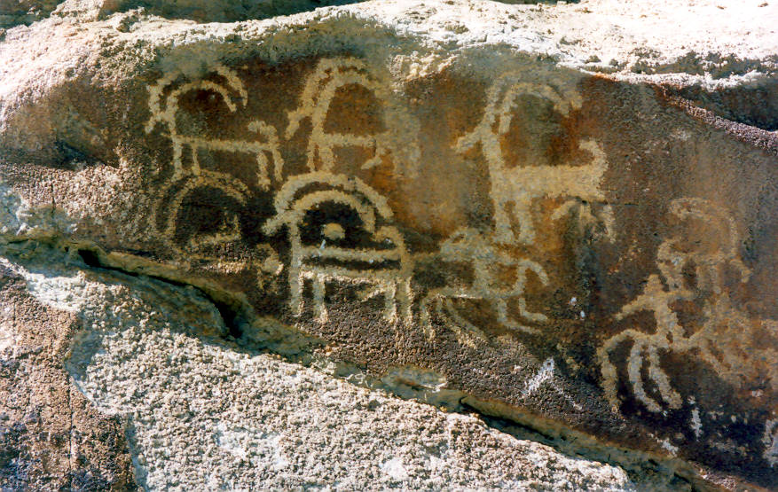

Ancient rock carvings near the Altit Fort, Hunza Valley.

## Comments (4)

**Bazal** - July 25, 2004 11:26 AM

Very cool snap...especially like the 5 legged monster looking whatchamacallit in the middle

---

**Zain** - April  3, 2005  8:13 AM

Yaar, I think this is the way how ancient people got around thousands of years ago, In other words, their way of offroading. ON the 4x4 Goats.

---

**sher nwaz** - February 12, 2010  4:38 PM

ja mzar le akhi daltas deshan

---

**Jeyce** - April 28, 2012  5:44 PM

Thank you for the plug in, I downloaded the newer vreison and tried it on my upgraded WP.2.0.6 (which I thought was the latest) and it doesn't seem to work propertly. I get the following error:Fatal error: Call to undefined function: stripos() in /mnt/w0600/d28/s04/a000pzyk/www/ethan/nfblog/wp-content/plugins/post-levels.php on line 177Any idea what I am doing wrong? Also I had the previous vreison of the post levels which did not give me that error but was hiding my archived dates which is why I upgraded the post Level plugin, any suggestions? thank you for your time and hard work

---

