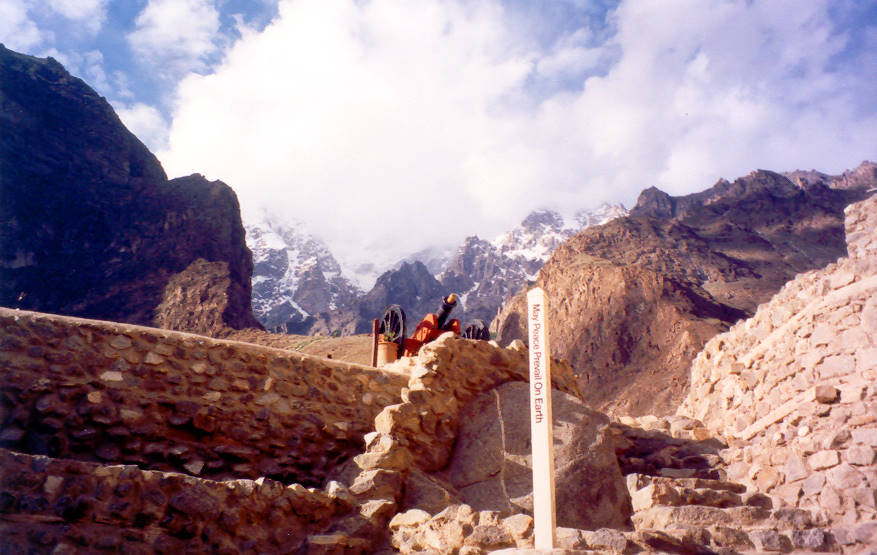

A view of what lies beyond the Baltit fort. The pillar in front of the cannon reads: " May peace prevail on Earth"!

## Comments (1)

**Tasawaar-ul-karim Baig** - June 27, 2005  7:02 PM

I went many times to karimabad (Baltit), Hunza. but never had a view, marvalous pic...i would say... you why Baltit name is Baltit, I will share short history with you, KANJOUT was the old name of the Hunza region and one of the MIR(hunza's Ruler) married to a Balti Royal women (balti word is taken from sakurdu and language of the region is also known as Balti), so MIR of that time keep this place Baltit and Baltit fort was made by those skilled Labours, who were sent by Balti ruler with her daughter to construct and fort for her. they were 200 in numbers.......

---

