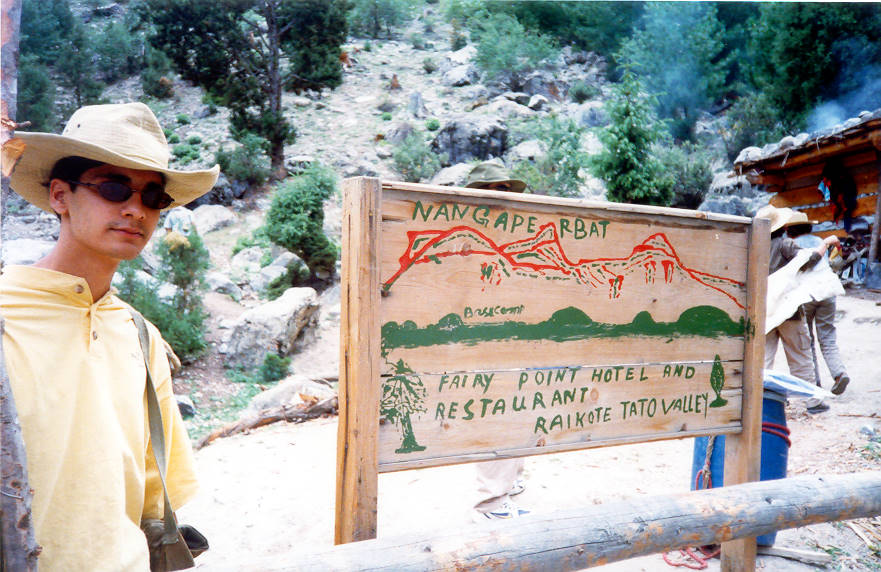

The jeep track ends at Tatu village at a height of about 6,000 feet. The walk to Fairy Meadows is about 5 kilometers reaching a height just below 12,000 feet. It is a 3 hour or longer walk (depending opon fitness and weight of backpack!) and is classed A+ according to the Lonely Planet guidebook. A+ means easy for some, but difficult for most.
We stopped here on our way to Fairy Meadows for lunch after our night stay at Shangrila Hotel Chilas. The lunch was very wholesome and consisted of French fries and lentil soup. We stuffed ourselves to prepare for unforseeable horrors despite warnings to the contrary.

## Comments (1)

**tanya** - February 26, 2004 11:11 PM

the food here was absolutely disgusting, unedible and the biggest rip off we've probably had to put up with till this day.... four plates of daal and a couple of dozen shreds of oily potato for fifteen hundred bucks!

