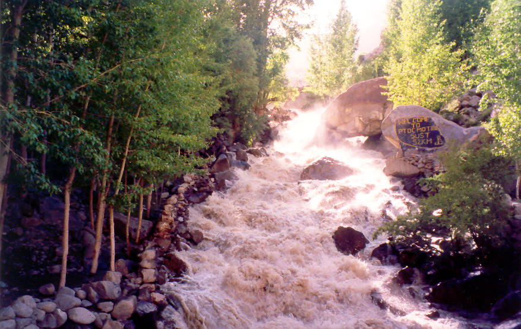

Not many people brave the rapids around here. Its a most impressive sight.

## Comments (3)

**Imad** - July 30, 2003  7:12 AM

I doubt ANYONE would even attempt to go down this thing in a boat. Considering the slope down which the water is cascading, it would be safe to assume this is a waterfall. A boat wouldn't last 10 ft on those rocks and man, would it hurt!!

**blerion** - July 25, 2005  3:23 PM

this place sims like albania, this mauntains, this valley are like the albaian mautains and valley.
hunza- in albanian language it means -nose- laik the form of the valley (hunza valley=nose vally)
bur- in albanian language it means -man- burushaski- means the language that is spouken by the man

**nur momad** - December 27, 2005  5:06 PM

this is a site in my village, Gulmit. It is called the Skordh Dhour (The terrain of bridge). In the summers me along with my friends would go here and sit at the side of the stream. The violent cascading sprays dews everywhere, making you blithe with the sense of the wet air.

