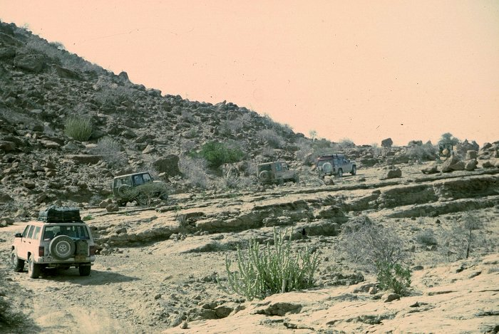

This was a nice drive, though once again the japanese car was holding up the real 4x4s.

## Comments (3)

**Salim Khan** - April  4, 2005 11:16 AM

Well, as we can all see, the Nissan Patrol was blazing the way for all the other so called 4X4s, and leading from the front......when the going gets tough--the tough get going.....

---

**Fahim Mirza** - September  6, 2005  4:52 AM

I was hoping to see the pic's of Wild Animals instead of wild Humans

---

**umair** - February 13, 2010 10:02 PM

they r all disels alltered ... if it wud hav been in there original petrol than i wud hav seen the nissan way bak .... jeep is jeep

---

