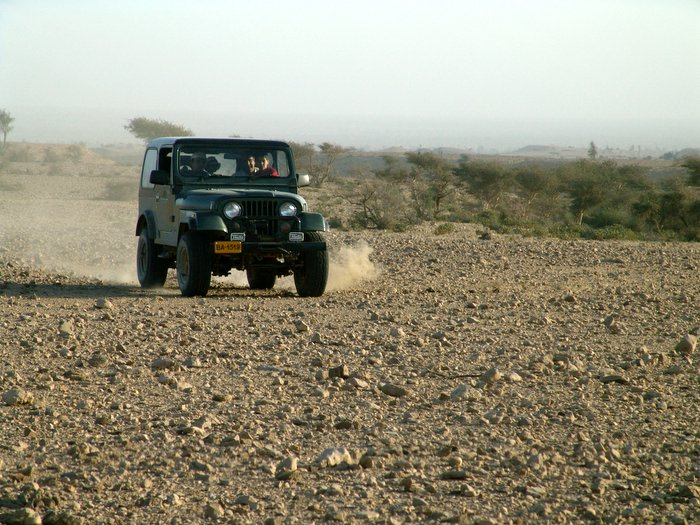

Saleem Khan driving like mad to get closer to the elusive deer. Taha can be seen holding on for deer life. They did manage to get a up close view of the hiran.

## Comments (3)

**Salman** - July  3, 2005  4:27 PM

KO, There are no deer in Kirthar. What u have reffered to as deer are actually Chinkara gazelles, so please make the necessary rectifications.

**Mohammad Khan** - January 13, 2006  4:17 PM

Hi
As an enthusiast of the wildlife of the Sub-continent, I would like to see more wildlife pics. If you guys get the chance to snap any wildlife then please post the pics. This will have the added benefit of documenting the rapidly disappearing wildlife too.
Later
Mohammad

**KO** - January 16, 2006  1:44 PM

Take a look at [<http://www.wildlifeofpakistan.com/>](http://www.wildlifeofpakistan.com/) for pictures and information on wildlife in Pakistan. It's a very well put together website, with a lot of information.

