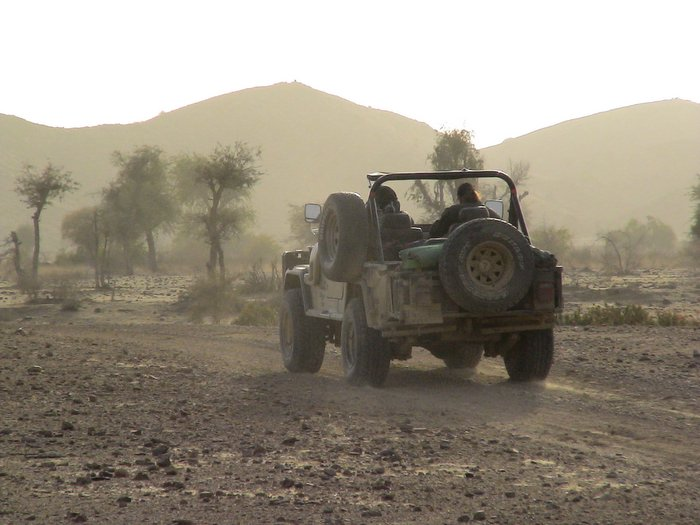

Setting out from Karchat. Doc Mansur's CJ.

## Comments (2)

**Amir** - September 21, 2007 11:30 PM

Hi,
You have a great site here, never wondered that Pakistan could offer so much for people who want to explore.

Got a question. I would like to visit Kirthar with my family members (Karchat center) - mid October.

Checked the Sindhwildlife site, but seems like their emails are bouncing.

Could you please provide with some info as to how we should plan (do not have jeeps). How far can we take our cars till we will require jeeps. And on an average how much would it cost (rough idea)? Will appreciate your input on this. Regards.
Amir

---

**KO** - September 25, 2007  2:19 PM

You will need a SUV or Jeep to reach Karchat, I would not recommend taking cars. A mehran would easily make it, but th erasta is hartd on bigger cars like Corolla's and Civics.

The govt. resthouse at Karchat center should not charge you, besides a nominal fee if any, and a tip to the chowkidar there. So there is not much cost, the main cost is for the fuel in getting there, and renting a car if need be.

---

