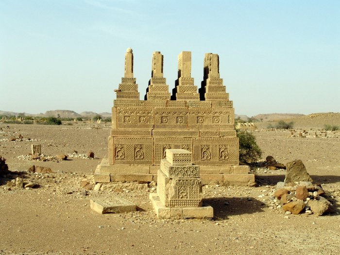

Some of Alexanders army is buried in this graveyard.

## Comments (2)

**Dr. Dev** - July 15, 2005 10:26 PM

my ancestors were the inhabitants of Hinglaj, the region of Hingol, Kirthar and the surrounding areas, when Alexander's armny passed throught.

---

**Anwar Raza** - November 23, 2005  9:15 PM

It is an awesome picture. Is there any protection from around this structure? The debris around the tombs show as if this site has been plundered ?? Do you see any writings on the wall? I am a history buff and would like to know.

---

