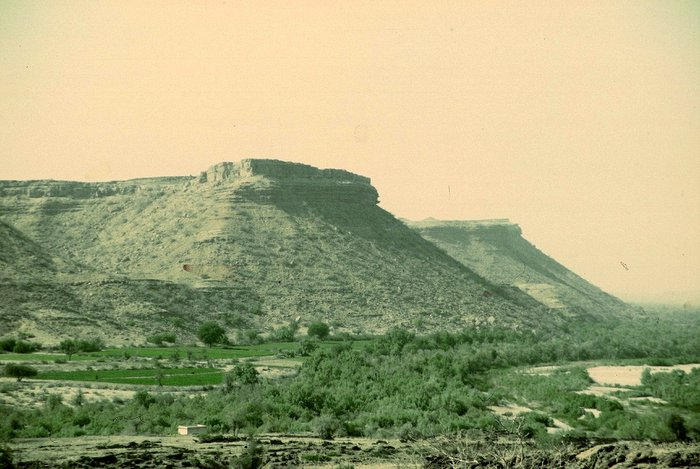

--landscape--

## Comments (1)

**Masood Ahmed** - May 22, 2005  3:26 PM

Take a deep breath; hold it on for few seconds; and immerse yourself in the present; only then you could grasp the greatness of Kirthar mountains. The mountains overwhelm you; the silence surrounds you; the landsacpe fills your heart with vastness and then you suddenly feel your becoming one with nature. O!!!! the Kirthar you expose your treasures only to few lucky ones.

