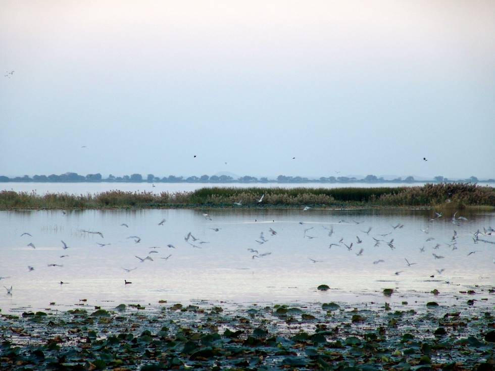

Haleji lake is on the way to the Makli tombs.

## Comments (1)

**Dr Shahid iqbal** - December  5, 2007  8:13 PM

Dear KO how to reach this lake? upto what time (I mean, March or April) these birds stay in Pakistan. Reply via e mail

